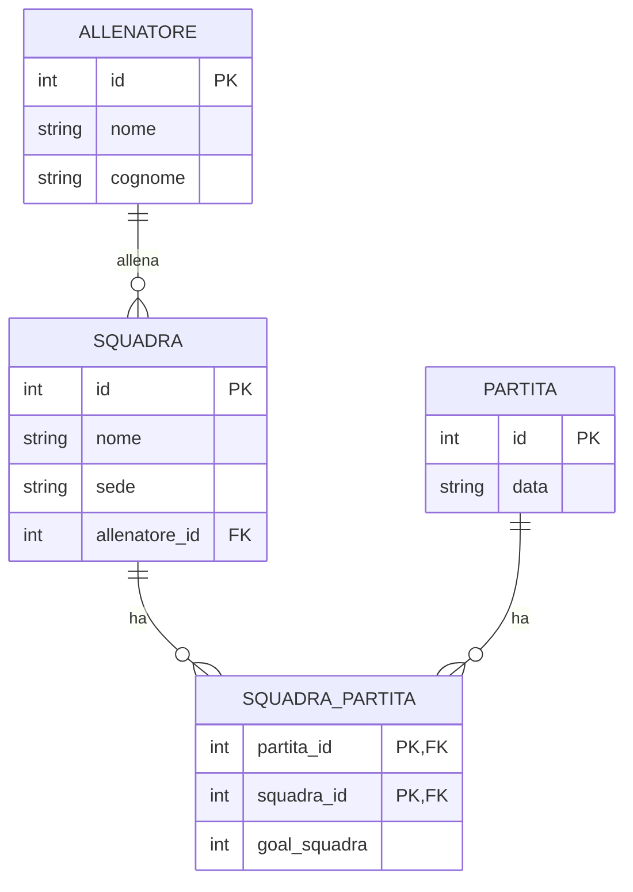

```mermaid
erDiagram

    ALLENATORE ||--o{ SQUADRA : allena
    %% SQUADRA }o--o{ PARTITA : giocano
    SQUADRA ||--o{ SQUADRA_PARTITA : ha
    PARTITA ||--o{ SQUADRA_PARTITA : ha

    ALLENATORE {
        int id PK
        string nome
        string cognome
    }

    SQUADRA {
        int id PK
        string nome
        string sede
        int allenatore_id FK
    }

    PARTITA {
        int id PK
        string data
    }

    SQUADRA_PARTITA {
        int partita_id PK, FK
        int squadra_id PK, FK
        int goal_squadra
    }


```