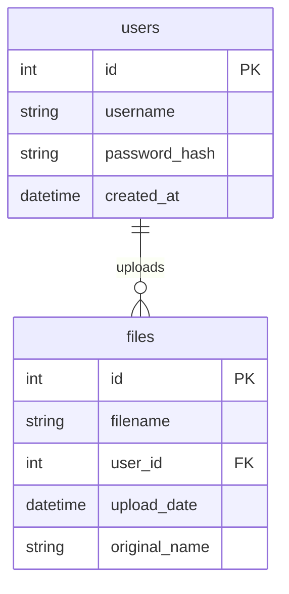

# PDF File Upload System Implementation Plan

## Project Structure

```
src/e18/
├── app.py
├── schema.sql
├── database.db
├── uploads/          # Directory for storing PDF files
└── templates/
    ├── base.html
    ├── login.html
    ├── register.html
    ├── index.html
    └── files.html
```

## Database Schema



## Database Code

```sql
-- Table for users
CREATE TABLE IF NOT EXISTS users (
    id INTEGER PRIMARY KEY AUTOINCREMENT,
    username TEXT NOT NULL UNIQUE,
    password_hash TEXT NOT NULL,
    created_at DATETIME DEFAULT CURRENT_TIMESTAMP
);

-- Table for uploaded files
CREATE TABLE IF NOT EXISTS files (
    id INTEGER PRIMARY KEY AUTOINCREMENT,
    filename TEXT NOT NULL,
    original_name TEXT NOT NULL,
    user_id INTEGER NOT NULL,
    upload_date DATETIME DEFAULT CURRENT_TIMESTAMP,
    FOREIGN KEY (user_id) REFERENCES users(id)
);
```

## Features and Endpoints

1. Authentication:

   - `/register` - User registration
   - `/login` - User login
   - `/logout` - User logout

2. File Management:
   - `/` - Dashboard showing user's files
   - `/upload` - PDF file upload endpoint
   - `/delete/<file_id>` - Delete file endpoint

## Implementation Steps

1. Initial Setup:

   - Create project directory structure
   - Set up Flask application with SQLite database
   - Create database schema

2. User Authentication:

   - Implement user registration
   - Implement login functionality
   - Add session management
   - Create login/register templates

3. File Upload System:

   - Create uploads directory
   - Implement PDF file validation
   - Add file upload functionality
   - Store file metadata in database

4. File Management:

   - Create file listing view
   - Implement file deletion
   - Add upload date/time display
   - Handle file permissions

5. Templates and Frontend:
   - Create base template
   - Build file management interface
   - Add error handling and notifications
