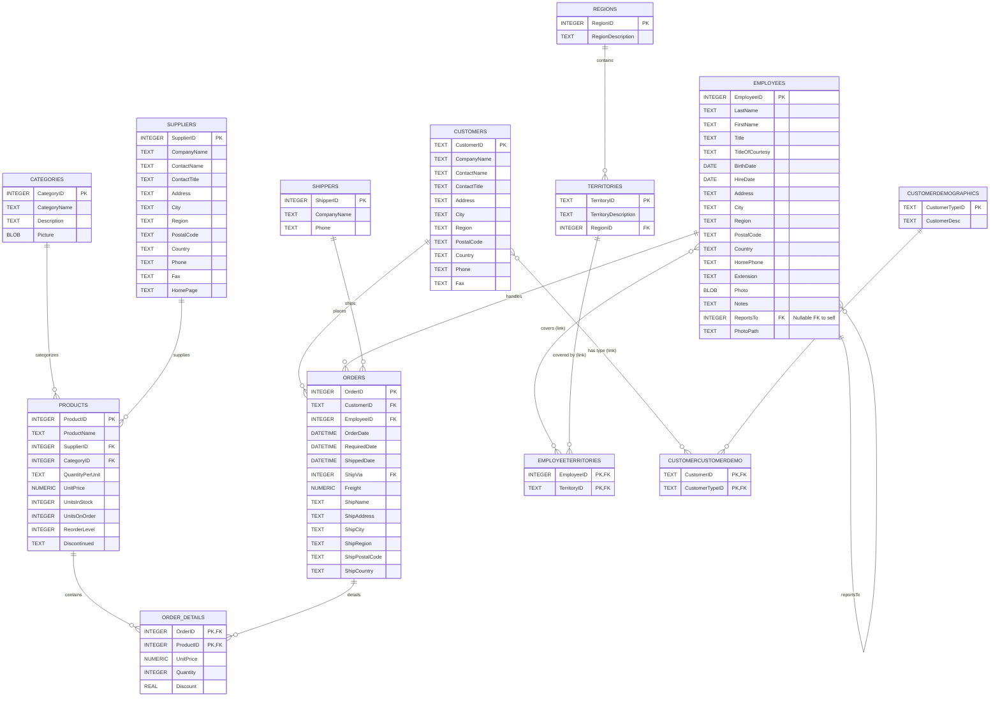

```mermaid
erDiagram
CUSTOMERS ||--o{ ORDERS : places
EMPLOYEES ||--o{ ORDERS : handles
SHIPPERS ||--o{ ORDERS : ships
PRODUCTS ||--o{ ORDER_DETAILS : contains
ORDERS ||--o{ ORDER_DETAILS : details
CATEGORIES ||--o{ PRODUCTS : categorizes
SUPPLIERS ||--o{ PRODUCTS : supplies
EMPLOYEES ||--o{ EMPLOYEES : reportsTo
REGIONS ||--o{ TERRITORIES : contains
EMPLOYEES }o--o{ EMPLOYEETERRITORIES : "covers (link)"
TERRITORIES ||--o{ EMPLOYEETERRITORIES : "covered by (link)"
CUSTOMERS }o--o{ CUSTOMERCUSTOMERDEMO : "has type (link)"
CUSTOMERDEMOGRAPHICS ||--o{ CUSTOMERCUSTOMERDEMO : "type for (link)"

    CATEGORIES {
        INTEGER CategoryID PK
        TEXT CategoryName
        TEXT Description
        BLOB Picture
    }

    CUSTOMERDEMOGRAPHICS {
        TEXT CustomerTypeID PK
        TEXT CustomerDesc
    }

    CUSTOMERS {
        TEXT CustomerID PK
        TEXT CompanyName
        TEXT ContactName
        TEXT ContactTitle
        TEXT Address
        TEXT City
        TEXT Region
        TEXT PostalCode
        TEXT Country
        TEXT Phone
        TEXT Fax
    }

    EMPLOYEES {
        INTEGER EmployeeID PK
        TEXT LastName
        TEXT FirstName
        TEXT Title
        TEXT TitleOfCourtesy
        DATE BirthDate
        DATE HireDate
        TEXT Address
        TEXT City
        TEXT Region
        TEXT PostalCode
        TEXT Country
        TEXT HomePhone
        TEXT Extension
        BLOB Photo
        TEXT Notes
        INTEGER ReportsTo FK "Nullable FK to self"
        TEXT PhotoPath
    }

    ORDER_DETAILS {
        INTEGER OrderID PK, FK
        INTEGER ProductID PK, FK
        NUMERIC UnitPrice
        INTEGER Quantity
        REAL Discount
    }

    ORDERS {
        INTEGER OrderID PK
        TEXT CustomerID FK
        INTEGER EmployeeID FK
        DATETIME OrderDate
        DATETIME RequiredDate
        DATETIME ShippedDate
        INTEGER ShipVia FK
        NUMERIC Freight
        TEXT ShipName
        TEXT ShipAddress
        TEXT ShipCity
        TEXT ShipRegion
        TEXT ShipPostalCode
        TEXT ShipCountry
    }

    PRODUCTS {
        INTEGER ProductID PK
        TEXT ProductName
        INTEGER SupplierID FK
        INTEGER CategoryID FK
        TEXT QuantityPerUnit
        NUMERIC UnitPrice
        INTEGER UnitsInStock
        INTEGER UnitsOnOrder
        INTEGER ReorderLevel
        TEXT Discontinued
    }

    REGIONS {
        INTEGER RegionID PK
        TEXT RegionDescription
    }

    SHIPPERS {
        INTEGER ShipperID PK
        TEXT CompanyName
        TEXT Phone
    }

    SUPPLIERS {
        INTEGER SupplierID PK
        TEXT CompanyName
        TEXT ContactName
        TEXT ContactTitle
        TEXT Address
        TEXT City
        TEXT Region
        TEXT PostalCode
        TEXT Country
        TEXT Phone
        TEXT Fax
        TEXT HomePage
    }

    TERRITORIES {
        TEXT TerritoryID PK
        TEXT TerritoryDescription
        INTEGER RegionID FK
    }

    %% Linking tables for many-to-many relationships
    EMPLOYEETERRITORIES {
        INTEGER EmployeeID PK, FK
        TEXT TerritoryID PK, FK
    }

    CUSTOMERCUSTOMERDEMO {
        TEXT CustomerID PK, FK
        TEXT CustomerTypeID PK, FK
    }
```
