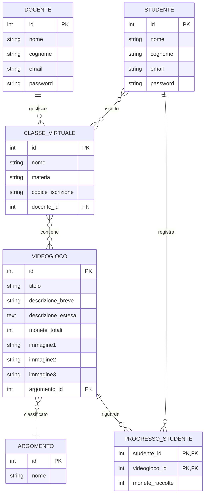
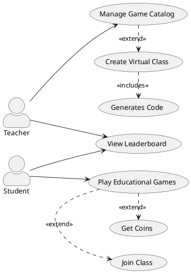

# Soluzione A038 - Piattaforma Educational Games

- [Testo](#testo)
- [Compito](#compito)
- [Analisi dei Requisiti](#analisi-dei-requisiti)
  - [Entità Principali](#entità-principali)
  - [Schema ER](#schema-er)
  - [Commento al Diagramma ER](#commento-al-diagramma-er)
- [Schema Logico](#schema-logico)
- [Definizioni SQL](#definizioni-sql)
- [Interrogazioni SQL](#interrogazioni-sql)
- [Progetto dell'Applicazione Web](#progetto-dellapplicazione-web)
  - [Struttura del Progetto](#struttura-del-progetto)
  - [1. Livello di Presentazione (Frontend)](#1-livello-di-presentazione-frontend)
  - [2. Livello della Logica Applicativa (Backend)](#2-livello-della-logica-applicativa-backend)
  - [3. Livello di Persistenza (Database)](#3-livello-di-persistenza-database)
  - [4. Connessione tra i Livelli](#4-connessione-tra-i-livelli)
  - [5. Strumenti Ausiliari](#5-strumenti-ausiliari)
- [Codice](#codice)

## Testo

Una scuola vuole progettare una piattaforma web per la fruizione di educational games (ovvero videogiochi in ambito educativo), per migliorare l’apprendimento nelle varie materie.

Ciascun docente, una volta completata la registrazione alla piattaforma, può creare una o più classi virtuali (identificate da un nome e una materia di pertinenza: es. 3B, matematica) e aprire l’iscrizione alle singole classi ai propri studenti tramite la condivisione del codice iscrizione (link o QR-code).

Nella piattaforma è presente il catalogo dei videogiochi didattici, classificati in base ad un elenco di argomenti prestabiliti (es: triangoli, legge di Ohm, verismo …): ciascun docente può selezionare uno o più videogiochi per includerli in una classe virtuale.

Per ogni videogioco è presente un titolo, una descrizione breve di massimo 160 caratteri, una descrizione estesa, il numero di “monete virtuali” che si possono raccogliere all’interno del gioco e fino a tre immagini sul gioco. Uno studente si iscriverà sulla piattaforma alle classi cui è stato invitato (es: 3B matematica, 3B italiano ...) tramite il relativo codice iscrizione, e all’interno di ciascuna classe troverà i link ai videogiochi didattici proposti dal docente. Svolgendo ciascun videogioco, lo studente potrà raccogliere sequenzialmente delle monete tramite quiz o attività da completare.

Una moneta è un riconoscimento che viene assegnato nel videogioco al raggiungimento di determinati traguardi educativi graduali. Attraverso il numero di monete, raccolte man mano da uno studente in ciascun videogioco di quella classe, si può determinare una classifica per ciascun gioco e anche una classifica generale comprensiva di tutti i giochi della classe; il docente può quindi seguire l’andamento degli studenti e supportarli individualmente nel completamento della raccolta delle monete.

## Compito

Il candidato, fatte le opportune ipotesi aggiuntive, sviluppi:

1. un’analisi della realtà di riferimento, giungendo alla definizione di uno schema concettuale della base di dati che, a suo motivato giudizio, sia idoneo a gestire la realtà presentata;
2. il relativo schema logico;
3. la definizione in linguaggio SQL di un sottoinsieme delle relazioni della base di dati in cui siano presenti alcune di quelle che contengono vincoli di integrità referenziale e/o vincoli di dominio, se esistenti;
4. le interrogazioni espresse in linguaggio SQL che restituiscono:
   1. l’elenco in ordine alfabetico dei giochi classificati per uno specifico argomento;
   2. la classifica degli studenti di una certa classe virtuale, in base alle monete raccolte per un certo gioco;
   3. il numero di classi in cui è utilizzato ciascun videogioco del catalogo;
5. il progetto di massima della struttura dell’applicazione web per la gestione della realtà sopra presentata;
6. una parte significativa dell'applicazione web che consente l’interazione con la base di dati, utilizzando appropriati linguaggi a scelta sia lato client che lato server.

## Analisi dei Requisiti

### Entità Principali

1. **Docente**

   - Gestisce il proprio account
   - Crea e gestisce classi virtuali
   - Seleziona videogiochi per le classi
   - Monitora i progressi degli studenti

2. **Studente**

   - Si iscrive alle classi tramite codice
   - Partecipa ai videogiochi
   - Accumula punti attraverso le monete raccolte
   - Visualizza i propri progressi

3. **ClasseVirtuale**

   - Identificata da nome e materia
   - Contiene un codice univoco per l'iscrizione
   - Collegata a uno o più videogiochi
   - Gestita da un docente specifico

4. **Videogioco**

   - Caratterizzato da titolo e descrizioni
   - Classificato per argomenti
   - Definisce il numero totale di monete ottenibili
   - Include immagini dimostrative

5. **Argomento**

   - Categorizza i videogiochi
   - Permette l'organizzazione del catalogo

### Schema ER



### Commento al Diagramma ER

Nel definire lo schema ER si è cercato di mantenere il modello sufficientemente semplice e al tempo stesso rappresentativo della realtà della piattaforma. Di seguito alcune scelte e le motivazioni relative:

1. **Entità Videogioco e Attributi Immagine**  
   Invece di creare un'entità separata per le immagini, sono stati inclusi fino a tre attributi (immagine1, immagine2, immagine3) direttamente nell'entità Videogioco.  
   _Motivazione:_  
   Il numero fisso di immagini consentite permette di evitare la complessità di gestire una relazione uno-a-molti per le immagini, semplificando la struttura e le query, pur garantendo la possibilità di associare diverse immagini a ciascun videogioco.

2. **Relazioni Molti-a-Molti Tramite Tabelle di Associazione**  
   Le tabelle Iscrizione, VideogiochiClasse e ProgressoStudente sono state introdotte per modellare correttamente le relazioni molti-a-molti.  
   _Motivazione:_  
   Queste strutture permettono una gestione flessibile del sistema, dove uno studente può partecipare a più classi e raccogliere monete in diversi videogiochi, e ciascun videogioco può essere associato a diverse classi.

## Schema Logico

Di seguito lo schema logico della base di dati, con le chiavi primarie sottolineate e le chiavi esterne indicate con FK:

- Docente(**id**, nome, cognome, email, password)
- Studente(**id**, nome, cognome, email, password)
- ClasseVirtuale(**id**, nome, materia, codice_iscrizione, docente_id[FK])
- Videogioco(**id**, titolo, descrizione_breve, descrizione_estesa, monete_totali, immagine1, immagine2, immagine3, argomento_id[FK])
- Argomento(**id**, nome)
- Iscrizione(**studente_id[FK]**, **classe_id[FK]**)
- VideogiochiClasse(**classe_id[FK]**, **videogioco_id[FK]**)
- ProgressoStudente(**studente_id[FK]**, **videogioco_id[FK]**, monete_raccolte)

## Definizioni SQL

```sql
-- Creazione delle tabelle principali
CREATE TABLE Docente (
    id INTEGER PRIMARY KEY AUTOINCREMENT,
    nome VARCHAR(50) NOT NULL,
    cognome VARCHAR(50) NOT NULL,
    email VARCHAR(100) NOT NULL UNIQUE,
    password VARCHAR(255) NOT NULL
);

CREATE TABLE Studente (
    id INTEGER PRIMARY KEY AUTOINCREMENT,
    nome VARCHAR(50) NOT NULL,
    cognome VARCHAR(50) NOT NULL,
    email VARCHAR(100) NOT NULL UNIQUE,
    password VARCHAR(255) NOT NULL
);

CREATE TABLE ClasseVirtuale (
    id INTEGER PRIMARY KEY AUTOINCREMENT,
    nome VARCHAR(50) NOT NULL,
    materia VARCHAR(50) NOT NULL,
    codice_iscrizione VARCHAR(20) NOT NULL UNIQUE,
    docente_id INTEGER NOT NULL,
    FOREIGN KEY (docente_id) REFERENCES Docente(id)
);

CREATE TABLE Videogioco (
    id INTEGER PRIMARY KEY AUTOINCREMENT,
    titolo VARCHAR(100) NOT NULL,
    descrizione_breve VARCHAR(160) NOT NULL CHECK (LENGTH(descrizione_breve) <= 160),
    descrizione_estesa TEXT NOT NULL,
    monete_totali INTEGER NOT NULL CHECK (monete_totali > 0),
    immagine1 VARCHAR(255) NOT NULL,
    immagine2 VARCHAR(255),
    immagine3 VARCHAR(255),
    argomento_id INTEGER NOT NULL,
    FOREIGN KEY (argomento_id) REFERENCES Argomento(id)
);

CREATE TABLE Argomento (
    id INTEGER PRIMARY KEY AUTOINCREMENT,
    nome VARCHAR(50) NOT NULL UNIQUE
);

-- Tabelle di relazione
CREATE TABLE Iscrizione (
    studente_id INTEGER,
    classe_id INTEGER,
    PRIMARY KEY (studente_id, classe_id),
    FOREIGN KEY (studente_id) REFERENCES Studente(id),
    FOREIGN KEY (classe_id) REFERENCES ClasseVirtuale(id)
);

CREATE TABLE VideogiochiClasse (
    classe_id INTEGER,
    videogioco_id INTEGER,
    PRIMARY KEY (classe_id, videogioco_id),
    FOREIGN KEY (classe_id) REFERENCES ClasseVirtuale(id),
    FOREIGN KEY (videogioco_id) REFERENCES Videogioco(id)
);

CREATE TABLE ProgressoStudente (
    studente_id INTEGER,
    videogioco_id INTEGER,
    monete_raccolte INTEGER NOT NULL DEFAULT 0 CHECK (monete_raccolte >= 0),
    PRIMARY KEY (studente_id, videogioco_id),
    FOREIGN KEY (studente_id) REFERENCES Studente(id),
    FOREIGN KEY (videogioco_id) REFERENCES Videogioco(id)
);
```

## Interrogazioni SQL

```sql
-- Query richieste
-- 1. Elenco in ordine alfabetico dei giochi classificati per uno specifico argomento
SELECT v.titolo, v.descrizione_breve
FROM Videogioco v
JOIN Argomento a ON v.argomento_id = a.id
WHERE a.nome = 'nome_argomento'
ORDER BY v.titolo ASC;

-- 2. Classifica degli studenti di una certa classe virtuale, in base alle monete raccolte per un certo gioco
SELECT s.nome,
       s.cognome,
       ps.monete_raccolte
FROM Iscrizione i
JOIN Studente s ON i.studente_id = s.id
JOIN ProgressoStudente ps ON s.id = ps.studente_id
WHERE i.classe_id = <valore_classe_virtuale> -- Sostituisci con l'id della classe virtuale
  AND ps.videogioco_id = <valore_videogioco>   -- Sostituisci con l'id del videogioco
ORDER BY ps.monete_raccolte DESC;


-- 3. Numero di classi in cui è utilizzato ciascun videogioco del catalogo
SELECT v.titolo, COUNT(DISTINCT vc.classe_id) as numero_classi
FROM Videogioco v
LEFT JOIN VideogiochiClasse vc ON v.id = vc.videogioco_id
GROUP BY v.id, v.titolo
ORDER BY numero_classi DESC;
```

## Progetto dell'Applicazione Web

L'applicazione utilizza:

- Python con Flask per il backend
- SQLite per il database
- HTML e Bootstrap per il frontend
- Form submissions per le interazioni utente

### Struttura del Progetto

```
educational-games/
├── app.py             # Applicazione Flask principale con le route
├── config.py          # Configurazioni centralizzate (opzionale)
├── schema.sql         # Definizione dello schema del database
├── requirements.txt   # Lista delle dipendenze
├── README.md         # Documentazione del progetto
├── static/           # Risorse statiche (CSS, JS, immagini)
│   ├── css/
│   ├── js/
│   └── images/
└── templates/        # Template HTML per il frontend
  ├── base.html
  ├── login.html
  ├── giochi.html
  ├── gioco.html
  └── classifica.html
```




## Codice

```python
from flask import Flask, render_template, request
import sqlite3

app = Flask(__name__)

def get_db():
    db = sqlite3.connect('educational_games.db')
    db.row_factory = sqlite3.Row
    return db

@app.route('/giochi')
def lista_giochi():
    db = get_db()
    giochi = db.execute('SELECT * FROM Videogioco').fetchall()
    return render_template('giochi.html', giochi=giochi)

@app.route('/gioco/<int:id>')
def dettaglio_gioco(id):
    db = get_db()
    gioco = db.execute('SELECT * FROM Videogioco WHERE id = ?', [id]).fetchone()
    classifica = db.execute('''
        SELECT s.nome, s.cognome, ps.monete_raccolte
        FROM Studente s
        JOIN ProgressoStudente ps ON s.id = ps.studente_id
        WHERE ps.videogioco_id = ?
        ORDER BY ps.monete_raccolte DESC
    ''', [id]).fetchall()
    return render_template('gioco.html', gioco=gioco, classifica=classifica)

if __name__ == '__main__':
    app.run(debug=True)
```

```html
<!-- templates/base.html -->
<!DOCTYPE html>
<html lang="it">
  <head>
    <meta charset="UTF-8" />
    <meta name="viewport" content="width=device-width, initial-scale=1.0" />
    <title>Educational Games</title>
    <link
      rel="stylesheet"
      href="https://stackpath.bootstrapcdn.com/bootstrap/4.5.2/css/bootstrap.min.css"
    />
  </head>
  <body>
    <nav class="navbar navbar-expand-lg navbar-light bg-light">
      <div class="navbar-nav">
        <a class="nav-link" href="{{ url_for('lista_giochi') }}">Catalogo</a>
        <a class="nav-link" href="{{ url_for('login') }}">Login</a>
      </div>
    </nav>

    <div class="container mt-4"></div>

    <script src="https://code.jquery.com/jquery-3.5.1.slim.min.js"></script>
    <script src="https://stackpath.bootstrapcdn.com/bootstrap/4.5.2/js/bootstrap.min.js"></script>
  </body>
</html>
```

```html
<!-- templates/giochi.html -->
 
<div class="container">
  <h1>Catalogo Giochi</h1>
  <div class="row">
    
    <div class="col-md-4 mb-4">
      <div class="card">
        <div class="card-body">
          <h5 class="card-title">{{ gioco.titolo }}</h5>
          <p class="card-text">{{ gioco.descrizione_breve }}</p>
          <a
            href="{{ url_for('dettaglio_gioco', id=gioco.id) }}"
            class="btn btn-primary"
            >Vedi Dettagli</a
          >
        </div>
      </div>
    </div>
    
  </div>
</div>

```

```html
<!-- templates/gioco.html -->
 
<div class="container">
  <h2>{{ gioco.titolo }}</h2>
  <p>{{ gioco.descrizione_breve }}</p>
  <div class="row mt-4">
    <div class="col-md-8">
      <h3>Descrizione</h3>
      <p>{{ gioco.descrizione_estesa }}</p>
      <p>Monete totali: {{ gioco.monete_totali }}</p>
    </div>
    <div class="col-md-4">
      <h3>Classifica</h3>
      <table class="table">
        <thead>
          <tr>
            <th>#</th>
            <th>Studente</th>
            <th>Monete</th>
          </tr>
        </thead>
        <tbody>
          
          <tr>
            <td>{{ i }}</td>
            <td>{{ studente.nome }} {{ studente.cognome }}</td>
            <td>{{ studente.monete_raccolte }}</td>
          </tr>
          
        </tbody>
      </table>
    </div>
  </div>
</div>

```
