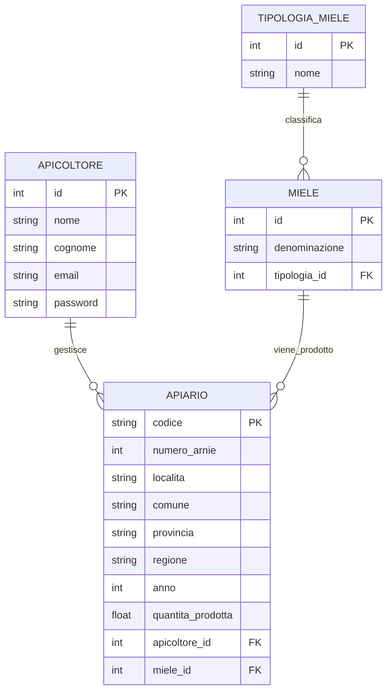

## Analisi dei Requisiti

### Entità Principali

1. **Apicoltore**

   - Gestisce i propri apiari
   - Registra le produzioni annuali di miele
   - Si registra sulla piattaforma per inserire i dati

2. **Apiario**

   - Identificato da un codice univoco
   - Composto da un numero di arnie
   - Localizzato in una specifica area geografica (località, comune, provincia, regione)
   - Produce un unico tipo di miele all'anno con una quantità specifica

3. **Miele**

   - Caratterizzato da una denominazione
   - Appartiene a una specifica tipologia (nazionale, regionale, territoriale, DOP)
   - Può essere prodotto da più apiari

4. **TipologiaMiele**
   - Classifica i mieli in quattro categorie:
     - Identità nazionale
     - Identità regionale
     - Identità territoriale
     - D.O.P.

### Schema ER



### Commento al Diagramma ER

Nel definire lo schema ER si è cercato di mantenere il modello sufficientemente semplice e al tempo stesso rappresentativo della realtà della banca dati dei mieli italiani. Di seguito alcune scelte e le relative motivazioni:

1. **Gestione delle Produzioni Annuali**

   - L'anno di produzione e la quantità sono stati inseriti direttamente nella tabella APIARIO anziché creare una tabella separata per le produzioni.
   - _Motivazione:_ Dato che ogni apiario produce un unico tipo di miele all'anno, questa soluzione semplifica la struttura mantenendo comunque tutte le informazioni necessarie.

2. **Relazione tra Miele e TipologiaMiele**

   - È stata creata un'entità separata per le tipologie di miele.
   - _Motivazione:_ Questo permette una gestione più flessibile delle categorie e facilita eventuali modifiche future alla classificazione.

3. **Gestione della Localizzazione**
   - Le informazioni geografiche (località, comune, provincia, regione) sono state mantenute come attributi dell'APIARIO.
   - _Motivazione:_ Questa scelta semplifica le query relative alla distribuzione geografica della produzione, pur mantenendo la granularità necessaria per le analisi territoriali.

## Schema Logico

Di seguito lo schema logico della base di dati, con le chiavi primarie sottolineate e le chiavi esterne indicate con FK:

- Apicoltore(**id**, nome, cognome, email, password)
- Apiario(**codice**, numero_arnie, localita, comune, provincia, regione, anno, quantita_prodotta, apicoltore_id[FK], miele_id[FK])
- Miele(**id**, denominazione, tipologia_id[FK])
- TipologiaMiele(**id**, nome)

Le relazioni tra le entità sono implementate attraverso chiavi esterne:

- APIARIO.apicoltore_id referenzia APICOLTORE.id
- APIARIO.miele_id referenzia MIELE.id
- MIELE.tipologia_id referenzia TIPOLOGIA_MIELE.id

## Definizioni SQL

```sql
-- Creazione della tabella TipologiaMiele
CREATE TABLE TipologiaMiele (
    id INTEGER PRIMARY KEY AUTOINCREMENT,
    nome VARCHAR(50) NOT NULL UNIQUE
);

-- Creazione della tabella Miele
CREATE TABLE Miele (
    id INTEGER PRIMARY KEY AUTOINCREMENT,
    denominazione VARCHAR(100) NOT NULL UNIQUE,
    tipologia_id INTEGER NOT NULL,
    FOREIGN KEY (tipologia_id) REFERENCES TipologiaMiele(id)
);

-- Creazione della tabella Apicoltore
CREATE TABLE Apicoltore (
    id INTEGER PRIMARY KEY AUTOINCREMENT,
    nome VARCHAR(50) NOT NULL,
    cognome VARCHAR(50) NOT NULL,
    email VARCHAR(100) NOT NULL UNIQUE,
    password VARCHAR(255) NOT NULL
);

-- Creazione della tabella Apiario
CREATE TABLE Apiario (
    codice VARCHAR(20) PRIMARY KEY,
    numero_arnie INTEGER NOT NULL CHECK (numero_arnie > 0),
    localita VARCHAR(100) NOT NULL,
    comune VARCHAR(100) NOT NULL,
    provincia VARCHAR(2) NOT NULL,
    regione VARCHAR(50) NOT NULL,
    anno INTEGER NOT NULL,
    quantita_prodotta FLOAT NOT NULL CHECK (quantita_prodotta >= 0),
    apicoltore_id INTEGER NOT NULL,
    miele_id INTEGER NOT NULL,
    FOREIGN KEY (apicoltore_id) REFERENCES Apicoltore(id),
    FOREIGN KEY (miele_id) REFERENCES Miele(id)
);
```

## Interrogazioni SQL

```sql
-- 1. L'elenco degli apicoltori che producono miele DOP in una determinata regione
SELECT DISTINCT a.nome, a.cognome, a.email
FROM Apicoltore a
JOIN Apiario ap ON a.id = ap.apicoltore_id
JOIN Miele m ON ap.miele_id = m.id
JOIN TipologiaMiele tm ON m.tipologia_id = tm.id
WHERE tm.nome = 'D.O.P.'
AND ap.regione = 'Veneto'  -- Esempio con regione Veneto
ORDER BY a.cognome, a.nome;

-- 2. Il numero complessivo di apiari per ciascuna regione
SELECT regione, COUNT(*) as numero_apiari
FROM Apiario
GROUP BY regione
ORDER BY numero_apiari DESC;

-- 3. Le quantità di miele prodotto in Italia lo scorso anno per ciascuna delle quattro tipologie
SELECT tm.nome as tipologia,
       SUM(ap.quantita_prodotta) as quantita_totale
FROM Apiario ap
JOIN Miele m ON ap.miele_id = m.id
JOIN TipologiaMiele tm ON m.tipologia_id = tm.id
WHERE ap.anno = YEAR(CURRENT_DATE) - 1
GROUP BY tm.id, tm.nome
ORDER BY tm.nome;
```

## Progetto dell'Applicazione Web

L'applicazione utilizza:

- Python con Flask per il backend
- SQLite per il database
- HTML e Bootstrap per il frontend
- Form submissions per le interazioni utente

### Struttura del Progetto

```
honey-database/
├── app.py             # Applicazione Flask principale
├── config.py          # Configurazioni dell'applicazione
├── schema.sql         # Schema del database
├── requirements.txt   # Dipendenze Python
├── README.md         # Documentazione
├── static/           # File statici
│   ├── css/         # Fogli di stile
│   ├── js/          # Script JavaScript
│   └── images/      # Immagini
└── templates/        # Template HTML
    ├── base.html    # Template base
    ├── login.html   # Form di login
    ├── register.html # Form di registrazione
    ├── dashboard/   # Sezione riservata
    │   ├── apicoltore.html    # Dashboard apicoltore
    │   ├── apiario.html       # Gestione apiario
    │   └── produzione.html    # Inserimento produzioni
    └── public/      # Sezione pubblica
        ├── home.html          # Homepage
        ├── catalogo.html      # Catalogo mieli
        └── statistiche.html   # Statistiche produzione
```

### 1. Livello di Presentazione (Frontend)

#### Template HTML e CSS (Bootstrap)

- Layout responsive per desktop e mobile
- Form per inserimento dati
- Visualizzazione dati in tabelle e grafici
- Mappe per localizzazione apiari

#### Interfacce Principali

1. **Area Pubblica**

   - Catalogo dei mieli italiani
   - Statistiche di produzione
   - Mappa degli apiari per regione

2. **Area Apicoltori**
   - Dashboard personale
   - Gestione apiari
   - Registrazione produzioni annuali
   - Visualizzazione statistiche personali

### 2. Livello della Logica Applicativa (Backend)

#### Applicazione Flask

- Gestione autenticazione e autorizzazione
- Validazione input
- Elaborazione dati
- Generazione report

#### Controller Principali

1. **Autenticazione**

   - Login/logout
   - Registrazione nuovi apicoltori
   - Gestione sessioni

2. **Gestione Apiari**

   - CRUD operazioni su apiari
   - Associazione mieli-apiari
   - Registrazione produzioni

3. **Reporting**
   - Generazione statistiche
   - Esportazione dati
   - Report personalizzati

## Codice

```python
from flask import Flask, render_template
import sqlite3

app = Flask(__name__)


def get_db():
    db = sqlite3.connect("honey_database.db")
    db.row_factory = sqlite3.Row
    return db


@app.route("/apiari")
def lista_apiari():
    db = get_db()
    apiari = db.execute("""
        SELECT a.*, ap.nome as apicoltore_nome, ap.cognome as apicoltore_cognome,
               m.denominazione as miele_denominazione, tm.nome as tipologia
        FROM Apiario a
        JOIN Apicoltore ap ON a.apicoltore_id = ap.id
        JOIN Miele m ON a.miele_id = m.id
        JOIN TipologiaMiele tm ON m.tipologia_id = tm.id
        ORDER BY a.regione, a.provincia, a.comune
    """).fetchall()
    return render_template("apiari.html", apiari=apiari)


if __name__ == "__main__":
    app.run(debug=True)
```

```html
<!-- templates/base.html -->
<!DOCTYPE html>
<html lang="it">
  <head>
    <meta charset="UTF-8" />
    <meta name="viewport" content="width=device-width, initial-scale=1.0" />
    <title>Banca Dati Mieli Italiani</title>
    <link
      rel="stylesheet"
      href="https://stackpath.bootstrapcdn.com/bootstrap/4.5.2/css/bootstrap.min.css"
    />
  </head>
  <body>
    <nav class="navbar navbar-expand-lg navbar-dark bg-dark">
      <div class="container">
        <a class="navbar-brand" href="#">Mieli Italiani</a>
        <div class="navbar-nav">
          <a class="nav-link" href="/apiari">Apiari</a>
          <a class="nav-link" href="/login">Login</a>
        </div>
      </div>
    </nav>

    <div class="container mt-4"></div>

    <script src="https://code.jquery.com/jquery-3.5.1.slim.min.js"></script>
    <script src="https://stackpath.bootstrapcdn.com/bootstrap/4.5.2/js/bootstrap.min.js"></script>
  </body>
</html>
```

```html
<!-- templates/apiari.html -->
 
<div class="container">
  <h1 class="mb-4">Apiari Italiani</h1>

  <div class="table-responsive">
    <table class="table table-striped">
      <thead>
        <tr>
          <th>Codice</th>
          <th>Località</th>
          <th>Comune</th>
          <th>Provincia</th>
          <th>Regione</th>
          <th>N° Arnie</th>
          <th>Apicoltore</th>
          <th>Miele</th>
          <th>Tipologia</th>
          <th>Azioni</th>
        </tr>
      </thead>
      <tbody>
        
        <tr>
          <td>{{ apiario.codice }}</td>
          <td>{{ apiario.localita }}</td>
          <td>{{ apiario.comune }}</td>
          <td>{{ apiario.provincia }}</td>
          <td>{{ apiario.regione }}</td>
          <td>{{ apiario.numero_arnie }}</td>
          <td>
            {{ apiario.apicoltore_nome }} {{ apiario.apicoltore_cognome }}
          </td>
          <td>{{ apiario.miele_denominazione }}</td>
          <td><span class="badge badge-info">{{ apiario.tipologia }}</span></td>
          <td>
            <a
              href="{{ url_for('dettaglio_apiario', codice=apiario.codice) }}"
              class="btn btn-sm btn-primary"
            >
              Dettagli
            </a>
          </td>
        </tr>
        
      </tbody>
    </table>
  </div>
</div>

```
