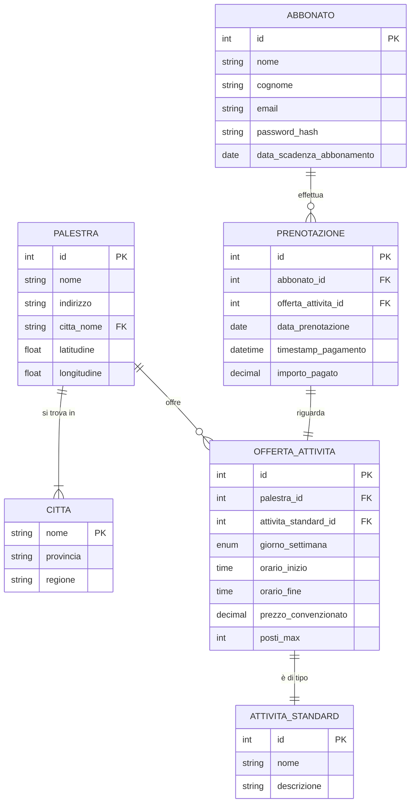
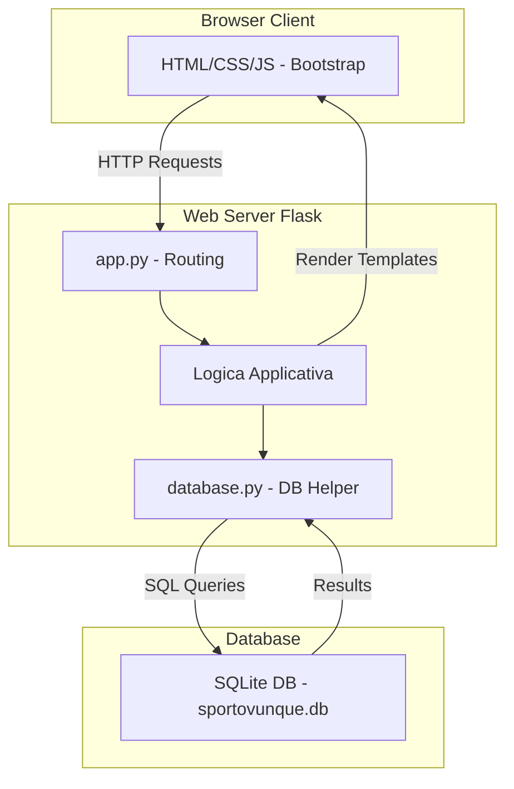

# Soluzione A038 SUP23 - Piattaforma SportOvunque

- [Testo](#testo)
- [Compito](#compito)
- [Analisi dei Requisiti](#analisi-dei-requisiti)
  - [Entità Principali](#entità-principali)
  - [Schema ER](#schema-er)
  - [Commento al Diagramma ER](#commento-al-diagramma-er)
- [Schema Logico](#schema-logico)
- [Definizioni SQL](#definizioni-sql)
- [Interrogazioni SQL](#interrogazioni-sql)
- [Progetto dell'Applicazione Web](#progetto-dellapplicazione-web)
  - [Struttura del Progetto](#struttura-del-progetto)
  - [Diagramma dei Componenti (Alto Livello)](#diagramma-dei-componenti-alto-livello)
- [Codice](#codice)

## Testo

La società SportOvunque, proprietaria di diverse palestre di fitness in alcune città d’Italia, vuole lanciare un servizio innovativo che dia la possibilità alle persone che viaggiano di poter accedere, con un unico abbonamento, ad attività offerte da palestre gestite anche da altre società, in tutta Italia.

A tale scopo SportOvunque ha preso accordi con palestre interessate ad aderire a questa iniziativa su tutto il territorio nazionale.

Le palestre che hanno aderito praticheranno tariffe di ingresso agevolate riservate agli abbonati di SportOvunque.

L’abbonamento a questo servizio può essere acquistato sul portale web di SportOvunque, dove i potenziali clienti possono registrarsi pagando on-line la relativa quota annuale.

Ogni palestra che aderisce all’iniziativa dovrà caricare sul portale i propri dati, comprensivi di indirizzo, città e coordinate geografiche.

Dovrà poi caricare anche la propria offerta di fitness: per ogni tipologia standardizzata di attività (es: Sala macchine, GAG, Zumba, Pilates ecc…) resa disponibile agli abbonati, indicherà i giorni della settimana (lunedì, martedì, …) in cui le attività vengono svolte, ciascuna con gli orari in cui possono essere prenotate, il relativo prezzo convenzionato e il numero massimo di posti disponibili.

Un abbonato potrà prenotare attività presso una qualsiasi palestra tra quelle presenti sul portale: individuerà la palestra, l’attività, il giorno della settimana e l’orario, e sceglierà la data specifica di suo interesse.

Se in quella data sono già state effettuate prenotazioni in numero pari al massimo dei posti disponibili per quell’attività, l’attività non sarà prenotabile.

Altrimenti la prenotazione verrà regolarmente registrata, e l’abbonato pagherà on-line il relativo prezzo a SportOvunque; quest’ultima provvederà poi a versare mensilmente, alle varie palestre che hanno aderito al servizio, gli incassi relativi alle attività prenotate.

## Compito

Il candidato, fatte le opportune ipotesi aggiuntive, sviluppi:

1. un’analisi della realtà di riferimento, giungendo alla definizione di uno schema concettuale della base di dati che, a suo motivato giudizio, sia idoneo a gestire la realtà presentata;
2. il relativo schema logico;
3. la definizione in linguaggio SQL di un sottoinsieme delle relazioni della base di dati in cui siano presenti alcune di quelle che contengono vincoli di integrità referenziale e/o vincoli di dominio, se esistenti;
4. le interrogazioni espresse in linguaggio SQL che restituiscono:
   1. l’elenco delle attività disponibili in una data città il mercoledì, indicando, per ciascuna attività, la palestra, la tipologia di attività, l’orario di svolgimento, il numero massimo di posti disponibili, ed il prezzo, ordinate per palestra;
   2. l’importo totale delle prenotazioni pagate dagli abbonati nel mese di aprile, che SportOvunque dovrà versare ad una determinata palestra;
   3. la classifica annuale delle palestre di una certa città, ordinata in base al numero di attività prenotate;
5. il progetto di massima della struttura dell’applicazione web per la gestione della realtà sopra presentata;
6. una parte significativa dell'applicazione web che consente l’interazione con la base di dati, utilizzando appropriati linguaggi a scelta sia lato client che lato server.

## Analisi dei Requisiti

### Entità Principali

1.  **Palestra**: Rappresenta una palestra che aderisce all'iniziativa. Contiene dati anagrafici e di localizzazione.
2.  **Abbonato**: Un utente registrato al servizio SportOvunque con un abbonamento attivo.
3.  **AttivitaStandard**: Una tipologia di attività fitness standardizzata (es. Pilates, Zumba).
4.  **OffertaAttivita**: Rappresenta una specifica attività offerta da una palestra in determinati giorni/orari, con un prezzo e capacità definiti.
5.  **Prenotazione**: Una prenotazione effettuata da un abbonato per una specifica OffertaAttivita in una data precisa.
6.  **Citta**: Rappresenta le città in cui si trovano le palestre.

### Schema ER



### Commento al Diagramma ER

1.  **Entità Citta**: È stata introdotta un'entità `CITTA` per normalizzare i dati relativi alle città e facilitare le ricerche geografiche. La palestra è collegata alla città tramite una chiave esterna `citta_nome`.
2.  **OffertaAttivita**: Questa entità modella la disponibilità di un'attività specifica (`attivita_standard_id`) presso una `palestra_id` in un determinato `giorno_settimana` e `orario_inizio`/`orario_fine`, con `prezzo_convenzionato` e `posti_max`.
3.  **Prenotazione**: Collega un `Abbonato` a una `OffertaAttivita` per una `data_prenotazione` specifica. Include dettagli sul pagamento (`timestamp_pagamento`, `importo_pagato`).
4.  **Giorno Settimana**: Modellato come `enum` per semplicità, assumendo che le offerte siano fisse settimanalmente.
5.  **Abbonato**: Include `data_scadenza_abbonamento` per verificare la validità dell'abbonamento al momento della prenotazione (logica applicativa).

## Schema Logico

- Citta(**nome**, provincia, regione)
- Palestra(**id**, nome, indirizzo, citta_nome[FK], latitudine, longitudine)
- Abbonato(**id**, nome, cognome, email, password_hash, data_scadenza_abbonamento)
- AttivitaStandard(**id**, nome, descrizione)
- OffertaAttivita(**id**, palestra_id[FK], attivita_standard_id[FK], giorno_settimana, orario_inizio, orario_fine, prezzo_convenzionato, posti_max)
- Prenotazione(**id**, abbonato_id[FK], offerta_attivita_id[FK], data_prenotazione, timestamp_pagamento, importo_pagato)

## Definizioni SQL

```sql
-- Creazione tabella Citta
CREATE TABLE Citta (
    nome VARCHAR(100) PRIMARY KEY,
    provincia VARCHAR(50),
    regione VARCHAR(50)
);

-- Creazione tabella Palestra
CREATE TABLE Palestra (
    id INTEGER PRIMARY KEY AUTOINCREMENT,
    nome VARCHAR(100) NOT NULL,
    indirizzo VARCHAR(255) NOT NULL,
    citta_nome VARCHAR(100) NOT NULL,
    latitudine DECIMAL(9, 6),
    longitudine DECIMAL(9, 6),
    FOREIGN KEY (citta_nome) REFERENCES Citta(nome)
);

-- Creazione tabella Abbonato
CREATE TABLE Abbonato (
    id INTEGER PRIMARY KEY AUTOINCREMENT,
    nome VARCHAR(50) NOT NULL,
    cognome VARCHAR(50) NOT NULL,
    email VARCHAR(100) NOT NULL UNIQUE,
    password_hash VARCHAR(255) NOT NULL,
    data_scadenza_abbonamento DATE NOT NULL
);

-- Creazione tabella AttivitaStandard
CREATE TABLE AttivitaStandard (
    id INTEGER PRIMARY KEY AUTOINCREMENT,
    nome VARCHAR(100) NOT NULL UNIQUE,
    descrizione TEXT
);

-- Creazione tabella OffertaAttivita
CREATE TABLE OffertaAttivita (
    id INTEGER PRIMARY KEY AUTOINCREMENT,
    palestra_id INTEGER NOT NULL,
    attivita_standard_id INTEGER NOT NULL,
    giorno_settimana VARCHAR(10) NOT NULL CHECK (giorno_settimana IN ('Lunedì', 'Martedì', 'Mercoledì', 'Giovedì', 'Venerdì', 'Sabato', 'Domenica')),
    orario_inizio TIME NOT NULL,
    orario_fine TIME NOT NULL,
    prezzo_convenzionato DECIMAL(10, 2) NOT NULL CHECK (prezzo_convenzionato >= 0),
    posti_max INTEGER NOT NULL CHECK (posti_max > 0),
    FOREIGN KEY (palestra_id) REFERENCES Palestra(id),
    FOREIGN KEY (attivita_standard_id) REFERENCES AttivitaStandard(id),
    CHECK (orario_fine > orario_inizio)
);

-- Creazione tabella Prenotazione
CREATE TABLE Prenotazione (
    id INTEGER PRIMARY KEY AUTOINCREMENT,
    abbonato_id INTEGER NOT NULL,
    offerta_attivita_id INTEGER NOT NULL,
    data_prenotazione DATE NOT NULL,
    timestamp_pagamento DATETIME DEFAULT CURRENT_TIMESTAMP,
    importo_pagato DECIMAL(10, 2) NOT NULL,
    FOREIGN KEY (abbonato_id) REFERENCES Abbonato(id),
    FOREIGN KEY (offerta_attivita_id) REFERENCES OffertaAttivita(id)
    -- Vincolo complesso per posti disponibili gestito a livello applicativo o con trigger
);
```

## Interrogazioni SQL

```sql
-- 4.1 Elenco attività disponibili in una data città il mercoledì
SELECT
    pa.nome AS NomePalestra,
    ats.nome AS TipoAttivita,
    oa.orario_inizio,
    oa.orario_fine,
    oa.posti_max,
    oa.prezzo_convenzionato
FROM OffertaAttivita oa
JOIN Palestra pa ON oa.palestra_id = pa.id
JOIN AttivitaStandard ats ON oa.attivita_standard_id = ats.id
WHERE pa.citta_nome = 'NomeCittaSpecificata' -- Sostituire con la città desiderata
  AND oa.giorno_settimana = 'Mercoledì'
ORDER BY pa.nome, oa.orario_inizio;

-- 4.2 Importo totale prenotazioni Aprile per una palestra specifica
SELECT
    SUM(pr.importo_pagato) AS ImportoTotaleAprile
FROM Prenotazione pr
JOIN OffertaAttivita oa ON pr.offerta_attivita_id = oa.id
WHERE oa.palestra_id = 1 -- Sostituire con l'ID della palestra desiderata
  AND strftime('%Y-%m', pr.data_prenotazione) = strftime('%Y-', date('now')) || '04'; -- Assumendo anno corrente, mese Aprile

-- 4.3 Classifica annuale palestre di una città per numero prenotazioni
SELECT
    pa.nome AS NomePalestra,
    COUNT(pr.id) AS NumeroPrenotazioniAnnue
FROM Prenotazione pr
JOIN OffertaAttivita oa ON pr.offerta_attivita_id = oa.id
JOIN Palestra pa ON oa.palestra_id = pa.id
WHERE pa.citta_nome = 'NomeCittaSpecificata' -- Sostituire con la città desiderata
  AND strftime('%Y', pr.data_prenotazione) = strftime('%Y', date('now')) -- Assumendo anno corrente
GROUP BY pa.id, pa.nome
ORDER BY NumeroPrenotazioniAnnue DESC;

```

## Progetto dell'Applicazione Web

Si propone un'architettura web basata su **Flask** (Python) per il backend, **SQLite** per il database (come da definizioni SQL), e **HTML/CSS/JavaScript** con **Bootstrap** per il frontend.

### Struttura del Progetto

```
sportovunque-app/
├── app.py             # Applicazione Flask principale (route, logica)
├── database.py        # Funzioni helper per interagire con il DB
├── config.py          # Configurazioni (es. path DB)
├── schema.sql         # Schema SQL (già definito sopra)
├── requirements.txt   # Dipendenze Python (Flask, ...)
├── README.md
├── static/            # File statici (CSS, JS, immagini)
│   ├── css/
│   │   └── style.css
│   └── js/
│       └── script.js
└── templates/         # Template HTML (Jinja2)
    ├── base.html      # Layout base
    ├── index.html     # Homepage/Ricerca palestre
    ├── palestra.html  # Dettaglio palestra e offerte
    ├── prenota.html   # Form di prenotazione
    ├── profilo.html   # Profilo abbonato
    └── login.html
```

### Diagramma dei Componenti (Alto Livello)



## Codice

Esempio di una route Flask e template per visualizzare le offerte di una palestra.

```python
# app.py (estratto)
from flask import Flask, render_template, request, abort
import sqlite3
from datetime import date

app = Flask(__name__)
DATABASE = 'sportovunque.db' # Assumendo che il DB si chiami così

def get_db():
    conn = sqlite3.connect(DATABASE)
    conn.row_factory = sqlite3.Row
    return conn

@app.route('/palestra/<int:palestra_id>')
def dettaglio_palestra(palestra_id):
    db = get_db()
    palestra = db.execute('SELECT * FROM Palestra WHERE id = ?', (palestra_id,)).fetchone()
    if not palestra:
        abort(404) # Palestra non trovata

    offerte = db.execute('''
        SELECT oa.*, ats.nome AS nome_attivita
        FROM OffertaAttivita oa
        JOIN AttivitaStandard ats ON oa.attivita_standard_id = ats.id
        WHERE oa.palestra_id = ?
        ORDER BY oa.giorno_settimana, oa.orario_inizio
    ''', (palestra_id,)).fetchall()
    db.close()

    # Qui si potrebbe aggiungere logica per raggruppare per giorno, ecc.
    return render_template('palestra.html', palestra=palestra, offerte=offerte)

# Funzione per verificare disponibilità (esempio concettuale)
def verifica_disponibilita(db, offerta_id, data_richiesta):
    offerta = db.execute('SELECT posti_max FROM OffertaAttivita WHERE id = ?', (offerta_id,)).fetchone()
    if not offerta: return False # Offerta non valida

    prenotazioni_esistenti = db.execute(
        'SELECT COUNT(*) FROM Prenotazione WHERE offerta_attivita_id = ? AND data_prenotazione = ?',
        (offerta_id, data_richiesta)
    ).fetchone()[0]

    return prenotazioni_esistenti < offerta['posti_max']


if __name__ == '__main__':
    # Creare il DB se non esiste (solo per esempio)
    # init_db()
    app.run(debug=True)

```

```html
<!-- templates/palestra.html -->
 Dettaglio {{ palestra.nome }} 
<div class="container mt-4">
  <h1>{{ palestra.nome }}</h1>
  <p>{{ palestra.indirizzo }}, {{ palestra.citta_nome }}</p>
  <hr />
  <h2>Offerte Attività</h2>

  
  <table class="table table-striped">
    <thead>
      <tr>
        <th>Attività</th>
        <th>Giorno</th>
        <th>Orario</th>
        <th>Prezzo (€)</th>
        <th>Posti Max</th>
        <th>Azione</th>
      </tr>
    </thead>
    <tbody>
      
      <tr>
        <td>{{ offerta.nome_attivita }}</td>
        <td>{{ offerta.giorno_settimana }}</td>
        <td>{{ offerta.orario_inizio[:5] }} - {{ offerta.orario_fine[:5] }}</td>
        <td>{{ "%.2f"|format(offerta.prezzo_convenzionato) }}</td>
        <td>{{ offerta.posti_max }}</td>
        <td>
          <!-- Qui un form o link per la prenotazione,
                             passando offerta.id e richiedendo la data -->
          <a href="{{ url_for('pagina_prenotazione', offerta_id=offerta.id) }}" class="btn btn-primary btn-sm"
            >Prenota</a
          >
        </td>
      </tr>
      
    </tbody>
  </table>
  
  <p>Nessuna offerta disponibile per questa palestra al momento.</p>
  
</div>

```

```html
<!-- templates/base.html (esempio minimo) -->
<!DOCTYPE html>
<html lang="it">
  <head>
    <meta charset="UTF-8" />
    <meta name="viewport" content="width=device-width, initial-scale=1.0" />
    <title>SportOvunque</title>
    <link href="https://cdn.jsdelivr.net/npm/bootstrap@5.3.0/dist/css/bootstrap.min.css" rel="stylesheet" />
    <link rel="stylesheet" href="{{ url_for('static', filename='css/style.css') }}" />
  </head>
  <body>
    <nav class="navbar navbar-expand-lg navbar-light bg-light">
      <div class="container-fluid">
        <a class="navbar-brand" href="{{ url_for('index') }}">SportOvunque</a>
        <!-- Altri elementi navbar: ricerca, login, profilo -->
      </div>
    </nav>

    <main> </main>

    <footer class="text-center mt-4">
      <p>&copy; {{ now().year }} SportOvunque</p>
    </footer>

    <script src="https://cdn.jsdelivr.net/npm/bootstrap@5.3.0/dist/js/bootstrap.bundle.min.js"></script>
    <script src="{{ url_for('static', filename='js/script.js') }}"></script>
  </body>
</html>
```
