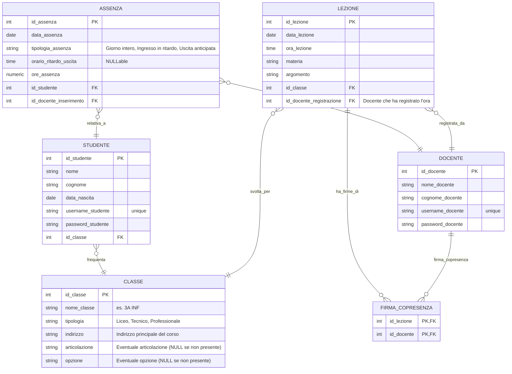

# Soluzione I044_SUP17 - Gestione Assenze Studenti

- [Testo](#testo)
- [Compito](#compito)
- [Analisi dei Requisiti](#analisi-dei-requisiti)
  - [Entità Principali](#entità-principali)
  - [Schema ER](#schema-er)
  - [Commento al Diagramma ER](#commento-al-diagramma-er)
- [Schema Logico](#schema-logico)
- [Definizioni SQL](#definizioni-sql)
- [Interrogazioni SQL](#interrogazioni-sql)
- [Progetto dell'Applicazione Web](#progetto-dellapplicazione-web)
  - [Struttura del Progetto](#struttura-del-progetto)
  - [Codice Esempio (Login Studente e Visualizzazione Assenze)](#codice-esempio-login-studente-e-visualizzazione-assenze)

## Testo

Una scuola superiore vuole gestire le assenze degli studenti.
Con assenze si intendono sia la mancata presenza per un giorno intero, sia l’ingresso in ritardo (con relativo orario), sia l’uscita anticipata (con relativo orario).
A questo scopo, la scuola richiede lo sviluppo di una applicazione Web che utilizza un database nel quale sono memorizzate, relativamente all’anno scolastico in corso, le seguenti informazioni:

- per ogni studente il nome, la data di nascita, la classe frequentata, lo username e la password di accesso per la consultazione, da parte dello studente e dei suoi genitori, delle assenze personali;
- le assenze, delle quali si deve registrare la data di effettuazione e la tipologia (giorno intero, ingresso in ritardo con relativo orario, uscita anticipata con relativo orario) ed il docente che l’ha inserita;
- le classi dell’istituto, con la tipologia (liceo o tecnico o professionale), l’indirizzo/articolazione/opzione di appartenenza (esempio 1: tecnico indirizzo Informatica e Telecomunicazioni articolazione Informatica; esempio 2: professionale indirizzo Servizi per l’enogastronomia e l’ospitalità alberghiera articolazione Enogastronomia opzione Prodotti dolciari artigianali e industriali; esempio 3: liceo indirizzo Classico);
- le ore di lezione effettivamente svolte dalle classi nel corso dell’anno: per ciascuna ora di lezione il docente registra data, ora, materia, argomento trattato. Eventuali docenti co-presenti (es. docente di laboratorio, docente di sostegno) firmano la loro presenza in aula accedendo autonomamente alla piattaforma con proprio username e password.

## Compito

Il candidato, fatte le opportune ipotesi aggiuntive, sviluppi:

1. un’analisi della realtà di riferimento, giungendo alla definizione di uno schema concettuale della base di dati che, a suo motivato giudizio, sia idoneo a gestire la realtà presentata;
2. il relativo schema logico;
3. le interrogazioni espresse in linguaggio SQL che restituiscono:
   1. elencare tutte le assenze dall’inizio dell’anno di un certo studente con la relativa data;
   2. elencare gli studenti che non hanno mai fatto assenze;
   3. visualizzare l’elenco degli studenti che hanno superato un certo numero di ore di assenza, riportando cognome, nome e classe di appartenenza;
4. il progetto di massima della struttura funzionale dell’applicazione Web, realizzando, con appropriati linguaggi a scelta sia lato client che lato server, la porzione dell’applicazione che consente di gestire l’accesso riservato da parte di uno studente, per visualizzare tutte le proprie assenze dall’inizio dell’anno con la relativa data (vedi interrogazione a. del punto 3).

## Analisi dei Requisiti

### Entità Principali

1.  **Studente**: Rappresenta uno studente iscritto alla scuola.
    - Attributi: nome, data di nascita, username, password, classe di appartenenza.
2.  **Classe**: Rappresenta una classe dell'istituto.
    - Attributi: nome identificativo (es. "3A INF"), tipologia (liceo, tecnico, professionale), indirizzo/articolazione/opzione.
3.  **Docente**: Rappresenta un insegnante della scuola.
    - Attributi: nome, cognome, username, password.
4.  **Assenza**: Rappresenta un'assenza di uno studente.
    - Attributi: data, tipologia (giorno intero, ingresso in ritardo, uscita anticipata), orario (per ritardi/uscite), ore_assenza, studente coinvolto, docente che ha inserito l'assenza.
5.  **Lezione**: Rappresenta un'ora di lezione svolta.
    - Attributi: data, ora, materia, argomento, classe, docente che ha registrato la lezione.
6.  **FirmaCopresenza**: Associazione tra una lezione e un docente co-presente.

### Schema ER



### Commento al Diagramma ER

1.  **Studente e Classe**: Ogni studente appartiene a una classe. La relazione è uno-a-molti da Classe a Studente.
2.  **Assenza**: Ogni assenza è relativa a un singolo studente ed è inserita da un docente. L'attributo `orario_ritardo_uscita` è `NULLABLE` perché non si applica alle assenze per l'intera giornata.
3.  **Docente**: I docenti hanno credenziali per accedere al sistema, inserire assenze e registrare lezioni.
4.  **Lezione**: Ogni lezione è tenuta per una specifica classe e registrata da un docente (principale per quell'ora). Materia e argomento sono attributi testuali. Per una gestione più strutturata, potrebbero diventare entità separate con proprie tabelle, ma per questo scenario si è optato per una soluzione più semplice.
5.  **FirmaCopresenza**: Modella la relazione molti-a-molti tra Lezione e Docente per tracciare i docenti co-presenti. Un docente può essere co-presente a più lezioni e una lezione può avere più docenti co-presenti.

## Schema Logico

Di seguito lo schema logico della base di dati, con le chiavi primarie sottolineate e le chiavi esterne indicate con \[FK]:

- STUDENTE(**id_studente** PK, nome, cognome, data_nascita, username_studente, password_studente, id_classe \[FK])
- CLASSE(**id_classe** PK, nome_classe, tipologia, indirizzo_articolazione_opzione)
- DOCENTE(**id_docente** PK, nome_docente, cognome_docente, username_docente, password_docente)
- ASSENZA(**id_assenza** PK, data_assenza, tipologia_assenza, orario_ritardo_uscita, ore_assenza, id_studente \[FK], id_docente_inserimento \[FK])
- LEZIONE(**id_lezione** PK, data_lezione, ora_lezione, materia, argomento, id_classe \[FK], id_docente_registrazione \[FK])
- FIRMA_COPRESENZA(**id_lezione** PK \[FK], **id_docente** PK \[FK])

## Definizioni SQL

```sql
CREATE TABLE CLASSE (
    id_classe INTEGER PRIMARY KEY AUTOINCREMENT,
    nome_classe VARCHAR(50) NOT NULL UNIQUE, -- Es. "3A INF"
    tipologia VARCHAR(50) NOT NULL CHECK (tipologia IN ('Liceo', 'Tecnico', 'Professionale')),
    indirizzo VARCHAR(100) NOT NULL,
    articolazione VARCHAR(100),  -- NULL se non presente
    opzione VARCHAR(100)         -- NULL se non presente
);

CREATE TABLE STUDENTE (
    id_studente INTEGER PRIMARY KEY AUTOINCREMENT,
    nome VARCHAR(50) NOT NULL,
    cognome VARCHAR(50) NOT NULL,
    data_nascita DATE NOT NULL,
    username_studente VARCHAR(50) NOT NULL UNIQUE,
    password_studente VARCHAR(255) NOT NULL, -- Hashed password
    id_classe INTEGER NOT NULL,
    FOREIGN KEY (id_classe) REFERENCES CLASSE(id_classe)
);

CREATE TABLE DOCENTE (
    id_docente INTEGER PRIMARY KEY AUTOINCREMENT,
    nome_docente VARCHAR(50) NOT NULL,
    cognome_docente VARCHAR(50) NOT NULL,
    username_docente VARCHAR(50) NOT NULL UNIQUE,
    password_docente VARCHAR(255) NOT NULL -- Hashed password
);

CREATE TABLE ASSENZA (
    id_assenza INTEGER PRIMARY KEY AUTOINCREMENT,
    data_assenza DATE NOT NULL,
    tipologia_assenza VARCHAR(50) NOT NULL CHECK (tipologia_assenza IN ('Giorno intero', 'Ingresso in ritardo', 'Uscita anticipata')),
    orario_ritardo_uscita TIME, -- NULL se 'Giorno intero'
    ore_assenza NUMERIC NOT NULL CHECK (ore_assenza > 0),
    id_studente INTEGER NOT NULL,
    id_docente_inserimento INTEGER NOT NULL,
    FOREIGN KEY (id_studente) REFERENCES STUDENTE(id_studente),
    FOREIGN KEY (id_docente_inserimento) REFERENCES DOCENTE(id_docente),
    CONSTRAINT chk_orario CHECK ( (tipologia_assenza = 'Giorno intero' AND orario_ritardo_uscita IS NULL) OR (tipologia_assenza != 'Giorno intero' AND orario_ritardo_uscita IS NOT NULL) )
);

CREATE TABLE LEZIONE (
    id_lezione INTEGER PRIMARY KEY AUTOINCREMENT,
    data_lezione DATE NOT NULL,
    ora_lezione TIME NOT NULL,
    materia VARCHAR(100) NOT NULL,
    argomento TEXT,
    id_classe INTEGER NOT NULL,
    id_docente_registrazione INTEGER NOT NULL, -- Docente che ha registrato l'ora
    FOREIGN KEY (id_classe) REFERENCES CLASSE(id_classe),
    FOREIGN KEY (id_docente_registrazione) REFERENCES DOCENTE(id_docente)
);

CREATE TABLE FIRMA_COPRESENZA (
    id_lezione INTEGER NOT NULL,
    id_docente INTEGER NOT NULL,
    PRIMARY KEY (id_lezione, id_docente),
    FOREIGN KEY (id_lezione) REFERENCES LEZIONE(id_lezione),
    FOREIGN KEY (id_docente) REFERENCES DOCENTE(id_docente)
);
```

## Interrogazioni SQL

```sql
-- a. Elencare tutte le assenze dall'inizio dell'anno di un certo studente con la relativa data.
-- (Assumendo che 'inizio dell'anno' significhi tutte le assenze registrate)
SELECT a.data_assenza, a.tipologia_assenza, a.orario_ritardo_uscita
FROM ASSENZA a
JOIN STUDENTE s ON a.id_studente = s.id_studente
WHERE s.username_studente = 'username_dello_studente'; -- Sostituire con lo username effettivo o usare s.id_studente


-- b. Elencare gli studenti che non hanno mai fatto assenze.
SELECT s.nome, s.cognome, c.nome_classe
FROM STUDENTE s
JOIN CLASSE c ON s.id_classe = c.id_classe
LEFT JOIN ASSENZA a ON s.id_studente = a.id_studente
WHERE a.id_assenza IS NULL
ORDER BY c.nome_classe, s.cognome, s.nome;

-- c. Visualizzare l'elenco degli studenti che hanno superato un certo numero di ore di assenza,
--    riportando cognome, nome e classe di appartenenza.
-- Si assume che la colonna 'ore_assenza' nella tabella ASSENZA contenga il numero di ore per ciascuna assenza.
-- Numero ore limite: 10 (parametro per la query)

SELECT
    s.cognome,
    s.nome,
    cl.nome_classe,
    SUM(a.ore_assenza) AS ore_assenza_totali
FROM STUDENTE s
JOIN ASSENZA a ON s.id_studente = a.id_studente
JOIN CLASSE cl ON s.id_classe = cl.id_classe
GROUP BY s.id_studente, cl.nome_classe
HAVING SUM(a.ore_assenza) > 10 -- Sostituire 10 con il numero di ore desiderato
ORDER BY ore_assenza_totali DESC, s.cognome, s.nome;
```

## Progetto dell'Applicazione Web

L'applicazione web sarà sviluppata utilizzando Python con il framework Flask per il backend, SQLite come database e HTML/CSS (eventualmente con Bootstrap) per il frontend.
La logica applicativa (ad esempio, nel file `app.py`) sarà responsabile del calcolo e dell'inserimento del valore corretto nel campo `ore_assenza` della tabella `ASSENZA` ogni volta che un'assenza viene registrata. Questo garantisce che il database memorizzi direttamente il numero di ore, semplificando le query successive.

### Struttura del Progetto

```
gestione_assenze_scuola/
├── app.py                     # Applicazione Flask principale con le route
├── database.db                # Database SQLite
├── schema.sql                 # Script per creare le tabelle (opzionale, usato per inizializzazione)
├── requirements.txt           # Dipendenze Python (Flask, ecc.)
├── static/                    # File statici (CSS, JS, immagini)
│   └── css/
│       └── style.css
└── templates/                 # Template HTML (Jinja2)
    ├── base.html              # Template base comune a tutte le pagine
    ├── login_studente.html    # Pagina di login per studenti
    ├── visualizza_assenze.html # Pagina per visualizzare le assenze dello studente
    └── dashboard_docente.html # (Esempio per future espansioni)
```

### Codice Esempio (Login Studente e Visualizzazione Assenze)

**`app.py` (Applicazione Flask)**

```python
from flask import Flask, render_template, request, redirect, url_for, session, g
import sqlite3
import hashlib # Per hashing password (usare librerie più robuste come passlib in produzione)

app = Flask(__name__)
app.secret_key = 'una_chiave_segreta_molto_segreta' # Cambiare in produzione!
DATABASE = 'database.db'

def get_db():
    db = getattr(g, '_database', None)
    if db is None:
        db = g._database = sqlite3.connect(DATABASE)
        db.row_factory = sqlite3.Row # Permette accesso ai campi per nome
    return db

@app.teardown_appcontext
def close_connection(exception):
    db = getattr(g, '_database', None)
    if db is not None:
        db.close()

def query_db(query, args=(), one=False):
    cur = get_db().execute(query, args)
    rv = cur.fetchall()
    cur.close()
    return (rv[0] if rv else None) if one else rv

def init_db():
    with app.app_context():
        db = get_db()
        with app.open_resource('schema.sql', mode='r') as f:
            db.cursor().executescript(f.read())
        db.commit()

# Funzione di utility per hash password (semplificata)
def hash_password(password):
    return hashlib.sha256(password.encode()).hexdigest()

@app.route('/')
def index():
    if 'studente_id' in session:
        return redirect(url_for('visualizza_assenze'))
    return redirect(url_for('login_studente'))

@app.route('/login_studente', methods=['GET', 'POST'])
def login_studente():
    if request.method == 'POST':
        username = request.form['username']
        password = request.form['password']

        # In un'applicazione reale, usare un metodo di hashing più sicuro
        # hashed_password = hash_password(password) # Non necessario se si confronta con hash nel DB

        studente = query_db('SELECT * FROM STUDENTE WHERE username_studente = ?', [username], one=True)

        if studente and studente['password_studente'] == hash_password(password): # Confronta con password hashata
            session['studente_id'] = studente['id_studente']
            session['studente_nome'] = studente['nome'] + " " + studente['cognome']
            return redirect(url_for('visualizza_assenze'))
        else:
            # Gestire errore login
            return render_template('login_studente.html', error="Username o password non validi.")

    return render_template('login_studente.html')

@app.route('/visualizza_assenze')
def visualizza_assenze():
    if 'studente_id' not in session:
        return redirect(url_for('login_studente'))

    studente_id = session['studente_id']
    assenze = query_db('''
        SELECT a.data_assenza, a.tipologia_assenza, a.orario_ritardo_uscita, d.nome_docente, d.cognome_docente
        FROM ASSENZA a
        JOIN DOCENTE d ON a.id_docente_inserimento = d.id_docente
        WHERE a.id_studente = ?
        ORDER BY a.data_assenza DESC
    ''', [studente_id])

    return render_template('visualizza_assenze.html', assenze=assenze, nome_studente=session.get('studente_nome'))

@app.route('/logout_studente')
def logout_studente():
    session.pop('studente_id', None)
    session.pop('studente_nome', None)
    return redirect(url_for('login_studente'))

if __name__ == '__main__':
    # init_db() # Eseguire una volta per creare le tabelle se schema.sql è presente
    # Esempio di inserimento utente (da fare una volta o tramite un'interfaccia admin)
    # db = sqlite3.connect(DATABASE)
    # cursor = db.cursor()
    # try:
    #     cursor.execute("INSERT INTO CLASSE (nome_classe, tipologia, indirizzo, articolazione, opzione) VALUES (?, ?, ?, ?, ?)",
    #                    ('3A INF', 'Tecnico', 'Informatica e Telecomunicazioni', 'Informatica', NULL))
    #     id_classe = cursor.lastrowid
    #     cursor.execute("INSERT INTO STUDENTE (nome, cognome, data_nascita, username_studente, password_studente, id_classe) VALUES (?, ?, ?, ?, ?, ?)",
    #                    ('Mario', 'Rossi', '2005-05-10', 'mario.rossi', hash_password('password123'), id_classe))
    #     cursor.execute("INSERT INTO DOCENTE (nome_docente, cognome_docente, username_docente, password_docente) VALUES (?, ?, ?, ?)",
    #                     ('Luigi', 'Verdi', 'luigi.verdi', hash_password('profpass')))
    #     db.commit()
    # except sqlite3.IntegrityError as e:
    #     print(f"Errore durante inserimento dati di esempio: {e}") # Probabilmente dati già esistenti
    # finally:
    #     db.close()

    app.run(debug=True)
```

**`templates/base.html`**

```html
<!DOCTYPE html>
<html lang="it">
  <head>
    <meta charset="UTF-8" />
    <meta name="viewport" content="width=device-width, initial-scale=1.0" />
    <title>Gestione Assenze</title>
    <link rel="stylesheet" href="{{ url_for('static', filename='css/style.css') }}" />
    <!-- Potresti includere Bootstrap o un altro framework CSS qui -->
  </head>
  <body>
    <header>
      <h1>Gestione Assenze Scolastiche</h1>
      <nav>
        
        <span>Benvenuto, {{ session.studente_nome }}!</span>
        <a href="{{ url_for('visualizza_assenze') }}">Le mie Assenze</a>
        <a href="{{ url_for('logout_studente') }}">Logout</a>
        
        <a href="{{ url_for('login_studente') }}">Login Studente</a>
        <!-- <a href="{{ url_for('login_docente') }}">Login Docente</a> -->
        
      </nav>
    </header>
    <main></main>
    <footer>
      <p>&copy; 2024 Scuola Superiore</p>
    </footer>
  </body>
</html>
```

**`templates/login_studente.html`**

```html
 Login Studente - {{ super() }} 
<h2>Login Studente</h2>

<p class="error">{{ error }}</p>

<form method="POST">
  <div>
    <label for="username">Username:</label>
    <input type="text" id="username" name="username" required />
  </div>
  <div>
    <label for="password">Password:</label>
    <input type="password" id="password" name="password" required />
  </div>
  <div>
    <button type="submit">Login</button>
  </div>
</form>

```

**`templates/visualizza_assenze.html`**

```html
 Le mie Assenze - {{ super() }} 
<h2>Le mie Assenze</h2>

<table>
  <thead>
    <tr>
      <th>Data</th>
      <th>Tipologia</th>
      <th>Orario (Ritardo/Uscita)</th>
      <th>Docente</th>
    </tr>
  </thead>
  <tbody>
    
    <tr>
      <td>{{ assenza.data_assenza }}</td>
      <td>{{ assenza.tipologia_assenza }}</td>
      <td>{{ assenza.orario_ritardo_uscita if assenza.orario_ritardo_uscita else '-' }}</td>
      <td>{{ assenza.nome_docente }} {{ assenza.cognome_docente }}</td>
    </tr>
    
  </tbody>
</table>

<p>Non hai nessuna assenza registrata.</p>
 
```

**`static/css/style.css` (Esempio)**

```css
body {
  font-family: sans-serif;
  margin: 0;
  background-color: #f4f4f4;
  color: #333;
}

header {
  background-color: #333;
  color: #fff;
  padding: 1em 0;
  text-align: center;
}

header h1 {
  margin: 0;
}

nav {
  padding: 0.5em;
}

nav a {
  color: #fff;
  margin: 0 10px;
  text-decoration: none;
}
nav span {
  margin-right: 15px;
}

main {
  padding: 20px;
  max-width: 800px;
  margin: 20px auto;
  background-color: #fff;
  border-radius: 8px;
  box-shadow: 0 0 10px rgba(0, 0, 0, 0.1);
}

h2 {
  color: #333;
}

table {
  width: 100%;
  border-collapse: collapse;
  margin-top: 20px;
}

th,
td {
  border: 1px solid #ddd;
  padding: 8px;
  text-align: left;
}

th {
  background-color: #f0f0f0;
}

.error {
  color: red;
  font-weight: bold;
}

form div {
  margin-bottom: 10px;
}

label {
  display: block;
  margin-bottom: 5px;
}

input[type="text"],
input[type="password"] {
  width: calc(100% - 22px);
  padding: 10px;
  border: 1px solid #ddd;
  border-radius: 4px;
}

button {
  background-color: #5cb85c;
  color: white;
  padding: 10px 15px;
  border: none;
  border-radius: 4px;
  cursor: pointer;
}

button:hover {
  background-color: #4cae4c;
}

footer {
  text-align: center;
  padding: 1em 0;
  background-color: #333;
  color: #fff;
  position: fixed;
  bottom: 0;
  width: 100%;
}
```

**Nota:** Il codice Flask fornito è un esempio base. In un'applicazione reale, si dovrebbero implementare misure di sicurezza più robuste (es. per la gestione delle password con `passlib` o `bcrypt`, protezione contro CSRF, XSS, SQL injection tramite ORM o parametri preparati in modo corretto), una gestione degli errori più completa e una struttura del codice più modulare. Lo script `schema.sql` dovrebbe contenere le `CREATE TABLE` definite precedentemente. L'inizializzazione del DB e l'inserimento di dati di esempio in `app.py` sono commentati e andrebbero gestiti in modo più appropriato (es. tramite comandi CLI di Flask o script separati).
