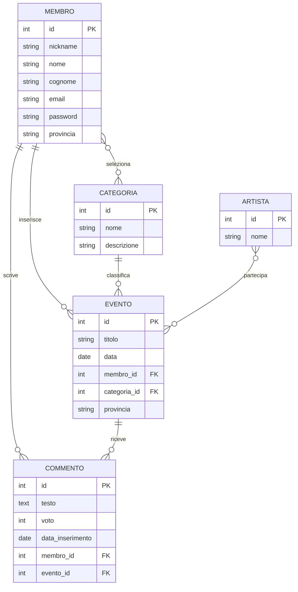
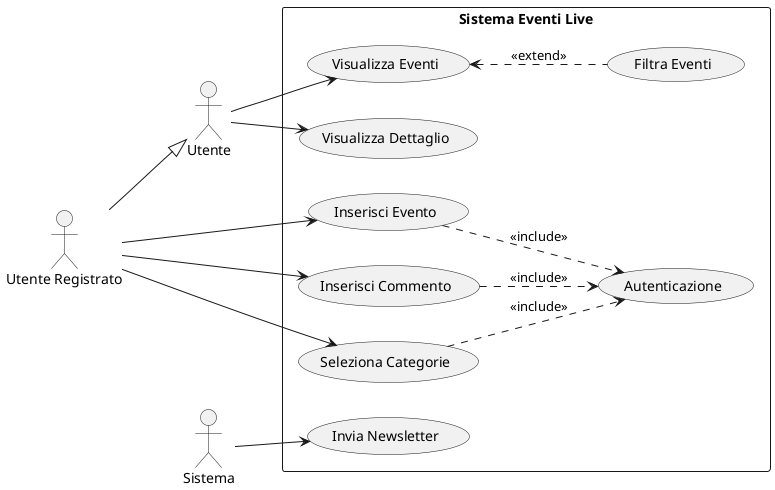

# Soluzione M963 - Web Community per Eventi dal Vivo

- [Testo](#testo)
- [Compito](#compito)
- [Analisi dei Requisiti](#analisi-dei-requisiti)
  - [Schema ER](#schema-er)

## Testo

Si vuole realizzare una web community per condividere dati e commenti relativi a eventi dal vivo di diverse categorie, ad esempio concerti, spettacoli teatrali, balletti, ecc. che si svolgono in Italia.

Gli eventi vengono inseriti sul sistema direttamente dai membri stessi della community, che si registrano sul sito fornendo un nickname, nome, cognome, indirizzo di e-mail e scegliendo una o più categorie di eventi a cui sono interessati.

Ogni membro iscritto riceve periodicamente per posta elettronica una newsletter, emessa automaticamente dal sistema, che riporta gli eventi delle categorie da lui scelte, che si svolgeranno nella settimana seguente nel territorio provinciale dell'utente.

I membri registrati possono interagire con la community sia inserendo i dati di un nuovo evento, per il quale occorre specificare categoria, luogo di svolgimento, data, titolo dell’evento e artisti coinvolti, sia scrivendo un post con un commento ed un voto (da 1 a 5) su un evento.

Il sito della community offre a tutti, sia membri registrati sia utenti anonimi, la consultazione dei dati on line, tra cui:

- visualizzazione degli eventi di un certo tipo in ordine cronologico, con possibilità di filtro per territorio di una specifica provincia
- visualizzazione di tutti i commenti e voti relativi ad un evento.

## Compito

Il candidato, fatte le opportune ipotesi aggiuntive, sviluppi

1. un’analisi della realtà di riferimento individuando le possibili soluzioni e scelga quella che a suo motivato giudizio è la più idonea a rispondere alle specifiche indicate
2. uno schema concettuale della base di dati
3. uno schema logico della base di dati
4. la definizione in linguaggio SQL di un sottoinsieme delle relazioni della base di dati in cui siano presenti alcune di quelle che contengono vincoli di integrità referenziale e/o vincoli di dominio, laddove presenti
5. le seguenti interrogazioni espresse in linguaggio SQL:
   1. elenco degli eventi già svolti, in ordine alfabetico di provincia
   2. elenco dei membri che non hanno mai inserito un commento
   3. per ogni evento il voto medio ottenuto in ordine di categoria e titolo
   4. i dati dell'utente che ha registrato il maggior numero di eventi
6. il progetto della pagina dell’interfaccia WEB che permetta ad un utente registrato di svolgere le operazioni specificate
7. la codifica in un linguaggio a scelta di un segmento significativo dell'applicazione Web che consente l'interazione con la base di dati.

## Analisi dei Requisiti

### Schema ER



### Commento al Diagramma ER

Nel definire lo schema ER si è cercato di rappresentare in modo completo le entità e relazioni necessarie per una web community di eventi dal vivo. Di seguito alcune scelte progettuali e le relative motivazioni:

1. **Entità MEMBRO**  
   Rappresenta gli utenti registrati della piattaforma, con i dati personali richiesti e la provincia per la geo-localizzazione degli eventi.
2. **Entità CATEGORIA ed EVENTO**  
   La separazione tra categorie ed eventi permette di classificare gli eventi e consentire agli utenti di selezionare categorie di interesse.
3. **Entità ARTISTA**  
   Separata dall'evento per consentire il riutilizzo degli artisti su più eventi e facilitare ricerche per artista.
4. **Entità COMMENTO**  
   Include sia il testo del commento che il voto numerico, con riferimenti al membro che l'ha inserito e all'evento commentato.
5. **Relazione MEMBRO-CATEGORIA**  
   Relazione molti-a-molti che permette ai membri di selezionare più categorie di interesse per la newsletter.

## Schema Logico

Di seguito lo schema logico della base di dati, con le chiavi primarie sottolineate e le chiavi esterne indicate con FK:

- MEMBRO(**id**, nickname, nome, cognome, email, password, provincia)
- CATEGORIA(**id**, nome, descrizione)
- EVENTO(**id**, titolo, data, provincia, membro_id[FK], categoria_id[FK])
- ARTISTA(**id**, nome)
- COMMENTO(**id**, testo, voto, data_inserimento, membro_id[FK], evento_id[FK])
- MEMBRO_CATEGORIA(**membro_id[FK]**, **categoria_id[FK]**)
- EVENTO_ARTISTA(**evento_id[FK]**, **artista_id[FK]**)

## Definizioni SQL

```sql
-- Creazione delle tabelle principali
CREATE TABLE MEMBRO (
    id INTEGER PRIMARY KEY AUTOINCREMENT,
    nickname VARCHAR(50) NOT NULL UNIQUE,
    nome VARCHAR(50) NOT NULL,
    cognome VARCHAR(50) NOT NULL,
    email VARCHAR(100) NOT NULL UNIQUE,
    password VARCHAR(255) NOT NULL,
    provincia VARCHAR(2) NOT NULL
);

CREATE TABLE CATEGORIA (
    id INTEGER PRIMARY KEY AUTOINCREMENT,
    nome VARCHAR(50) NOT NULL UNIQUE,
    descrizione TEXT -- Can store longer strings without a specified maximum length
);

CREATE TABLE EVENTO (
    id INTEGER PRIMARY KEY AUTOINCREMENT,
    titolo VARCHAR(100) NOT NULL,
    data DATE NOT NULL,
    provincia VARCHAR(2) NOT NULL,
    membro_id INTEGER NOT NULL,
    categoria_id INTEGER NOT NULL,
    FOREIGN KEY (membro_id) REFERENCES MEMBRO(id),
    FOREIGN KEY (categoria_id) REFERENCES CATEGORIA(id)
);

CREATE TABLE ARTISTA (
    id INTEGER PRIMARY KEY AUTOINCREMENT,
    nome VARCHAR(100) NOT NULL UNIQUE
);

CREATE TABLE COMMENTO (
    id INTEGER PRIMARY KEY AUTOINCREMENT,
    testo TEXT NOT NULL,
    voto INTEGER NOT NULL CHECK (voto BETWEEN 1 AND 5),
    data_inserimento TIMESTAMP DEFAULT CURRENT_TIMESTAMP,
    membro_id INTEGER NOT NULL,
    evento_id INTEGER NOT NULL,
    FOREIGN KEY (membro_id) REFERENCES MEMBRO(id),
    FOREIGN KEY (evento_id) REFERENCES EVENTO(id)
);

-- Tabelle di relazione molti-a-molti
CREATE TABLE MEMBRO_CATEGORIA (
    membro_id INTEGER,
    categoria_id INTEGER,
    PRIMARY KEY (membro_id, categoria_id),
    FOREIGN KEY (membro_id) REFERENCES MEMBRO(id),
    FOREIGN KEY (categoria_id) REFERENCES CATEGORIA(id)
);

CREATE TABLE EVENTO_ARTISTA (
    evento_id INTEGER,
    artista_id INTEGER,
    PRIMARY KEY (evento_id, artista_id),
    FOREIGN KEY (evento_id) REFERENCES EVENTO(id),
    FOREIGN KEY (artista_id) REFERENCES ARTISTA(id)
);
```

## Interrogazioni SQL

```sql
-- 1. Elenco degli eventi già svolti, in ordine alfabetico di provincia
SELECT e.titolo, e.data, e.provincia
FROM EVENTO e
WHERE e.data < CURRENT_DATE();
ORDER BY e.provincia ASC, e.data DESC;

-- 2. Elenco dei membri che non hanno mai inserito un commento
SELECT m.id, m.nickname, m.nome, m.cognome
FROM MEMBRO m
WHERE m.id NOT IN (
    SELECT DISTINCT c.membro_id
    FROM COMMENTO c
);

-- 3. Per ogni evento il voto medio ottenuto in ordine di categoria e titolo
SELECT e.id, e.titolo, c.nome AS categoria,
       AVG(com.voto) AS voto_medio
FROM EVENTO e
JOIN CATEGORIA c ON e.categoria_id = c.id
LEFT JOIN COMMENTO com ON e.id = com.evento_id
GROUP BY e.id
ORDER BY c.nome, e.titolo;

-- 4. I dati dell'utente che ha registrato il maggior numero di eventi
SELECT m.id, m.nickname, m.nome, m.cognome, m.email, m.provincia, COUNT(e.id) AS num_eventi
FROM MEMBRO m
JOIN EVENTO e ON m.id = e.membro_id
GROUP BY m.id
ORDER BY num_eventi DESC
LIMIT 1;
```

## Progetto dell'Interfaccia Web

### Struttura del Progetto

```
eventi-live-community/
├── app.py              # Applicazione Flask principale con le route
├── config.py           # Configurazioni dell'applicazione
├── database.py         # Connessione e funzioni database
├── requirements.txt    # Dipendenze del progetto
├── static/             # Risorse statiche
│   ├── css/            # Fogli di stile
│   ├── js/             # Script JavaScript
│   └── images/         # Immagini del sito
└── templates/          # Template HTML
    ├── base.html       # Template base con header e footer
    ├── index.html      # Homepage
    ├── auth/           # Template per autenticazione
    ├── eventi/         # Template per gestione eventi
    └── profilo/        # Template per profilo utente
```

### Diagramma dei Casi d'Uso



### Wireframe delle Pagine Principali

#### Homepage

- Header con logo, barra di ricerca e menu di navigazione
- Sezione evidenziata con eventi in primo piano
- Filtri per categoria e provincia
- Griglia di card con gli eventi più recenti
- Footer con informazioni di contatto e link utili

#### Dettaglio Evento

- Immagine e informazioni principali dell'evento
- Lista degli artisti coinvolti
- Sezione commenti con possibilità di inserimento (per utenti registrati)
- Valutazione media e distribuzione dei voti

#### Profilo Utente

- Informazioni personali e preferenze
- Eventi inseriti dall'utente
- Commenti lasciati dall'utente
- Gestione delle categorie di interesse

#### Inserimento Nuovo Evento

- Form con validazione per l'inserimento dei dati dell'evento
- Selezione multipla per gli artisti con possibilità di aggiungerne di nuovi
- Anteprima dell'evento prima della pubblicazione

## Codice dell'Applicazione

Di seguito una parte significativa dell'applicazione web che gestisce l'interazione con il database, usando Python con Flask per il backend e HTML/CSS/JavaScript per il frontend.

```python
from flask import Flask, render_template, request, redirect, url_for, flash, session
import sqlite3
from werkzeug.security import generate_password_hash, check_password_hash
from datetime import datetime, timedelta

app = Flask(__name__)
app.config['SECRET_KEY'] = 'chiave_segreta_per_la_sessione'

def get_db_connection():
    conn = sqlite3.connect('eventi_community.db')
    conn.row_factory = sqlite3.Row
    return conn

# Route principale che mostra gli eventi filtrati
@app.route('/')
def index():
    conn = get_db_connection()
    categoria_id = request.args.get('categoria', '')
    provincia = request.args.get('provincia', '')

    query = '''
        SELECT e.*, c.nome as categoria_nome
        FROM EVENTO e
        JOIN CATEGORIA c ON e.categoria_id = c.id
        WHERE 1=1
    '''
    params = []

    if categoria_id:
        query += ' AND e.categoria_id = ?'
        params.append(categoria_id)

    if provincia:
        query += ' AND e.provincia = ?'
        params.append(provincia)

    query += ' ORDER BY e.data ASC'
    eventi = conn.execute(query, params).fetchall()

    categorie = conn.execute('SELECT * FROM CATEGORIA').fetchall()
    province = conn.execute('SELECT DISTINCT provincia FROM EVENTO').fetchall()

    conn.close()
    return render_template('index.html', eventi=eventi, categorie=categorie, province=province)

# Route per la visualizzazione dettagliata di un evento
@app.route('/evento/<int:evento_id>')
def dettaglio_evento(evento_id):
    conn = get_db_connection()
    evento = conn.execute('SELECT e.*, c.nome as categoria_nome FROM EVENTO e JOIN CATEGORIA c ON e.categoria_id = c.id WHERE e.id = ?', [evento_id]).fetchone()

    if not evento:
        conn.close()
        flash('Evento non trovato', 'error')
        return redirect(url_for('index'))

    # Recupero degli artisti dell'evento
    artisti = conn.execute('''
        SELECT a.*
        FROM ARTISTA a
        JOIN EVENTO_ARTISTA ea ON a.id = ea.artista_id
        WHERE ea.evento_id = ?
    ''', [evento_id]).fetchall()

    # Recupero dei commenti e dei voti
    commenti = conn.execute('''
        SELECT c.*, m.nickname
        FROM COMMENTO c
        JOIN MEMBRO m ON c.membro_id = m.id
        WHERE c.evento_id = ?
        ORDER BY c.data_inserimento DESC
    ''', [evento_id]).fetchall()

    # Calcolo voto medio
    voto_medio = conn.execute('SELECT AVG(voto) as media FROM COMMENTO WHERE evento_id = ?', [evento_id]).fetchone()

    conn.close()
    return render_template('eventi/dettaglio.html', evento=evento, artisti=artisti, commenti=commenti, voto_medio=voto_medio)

# Route per l'inserimento di un nuovo commento
@app.route('/evento/<int:evento_id>/commento', methods=['POST'])
def inserisci_commento(evento_id):
    if 'utente_id' not in session:
        flash('Devi effettuare l\'accesso per commentare', 'error')
        return redirect(url_for('login'))

    testo = request.form.get('testo')
    voto = request.form.get('voto')

    if not testo or not voto:
        flash('Testo e voto sono obbligatori', 'error')
        return redirect(url_for('dettaglio_evento', evento_id=evento_id))

    try:
        voto = int(voto)
        if voto < 1 or voto > 5:
            raise ValueError
    except ValueError:
        flash('Il voto deve essere un numero da 1 a 5', 'error')
        return redirect(url_for('dettaglio_evento', evento_id=evento_id))

    conn = get_db_connection()
    conn.execute('''
        INSERT INTO COMMENTO (testo, voto, membro_id, evento_id)
        VALUES (?, ?, ?, ?)
    ''', (testo, voto, session['utente_id'], evento_id))
    conn.commit()
    conn.close()

    flash('Commento inserito con successo', 'success')
    return redirect(url_for('dettaglio_evento', evento_id=evento_id))

# Route per l'inserimento di un nuovo evento
@app.route('/nuovo-evento', methods=['GET', 'POST'])
def nuovo_evento():
    if 'utente_id' not in session:
        flash('Devi effettuare l\'accesso per inserire un evento', 'error')
        return redirect(url_for('login'))

    conn = get_db_connection()
    categorie = conn.execute('SELECT * FROM CATEGORIA').fetchall()

    if request.method == 'POST':
        titolo = request.form.get('titolo')
        data = request.form.get('data')
        provincia = request.form.get('provincia')
        categoria_id = request.form.get('categoria_id')
        artisti_ids = request.form.getlist('artisti')
        nuovi_artisti = request.form.get('nuovi_artisti', '').split(',')

        # Validazione dati
        if not titolo or not data or not provincia or not categoria_id:
            flash('Tutti i campi sono obbligatori', 'error')
            return render_template('eventi/nuovo.html', categorie=categorie)

        try:
            # Inserimento evento
            cursor = conn.execute('''
                INSERT INTO EVENTO (titolo, data, provincia, membro_id, categoria_id)
                VALUES (?, ?, ?, ?, ?)
            ''', (titolo, data, provincia, session['utente_id'], categoria_id))
            evento_id = cursor.lastrowid

            # Gestione artisti esistenti
            for artista_id in artisti_ids:
                conn.execute('''
                    INSERT INTO EVENTO_ARTISTA (evento_id, artista_id)
                    VALUES (?, ?)
                ''', (evento_id, artista_id))

            # Gestione nuovi artisti
            for nome_artista in nuovi_artisti:
                nome_artista = nome_artista.strip()
                if nome_artista:
                    cursor = conn.execute('INSERT INTO ARTISTA (nome) VALUES (?)', [nome_artista])
                    nuovo_artista_id = cursor.lastrowid
                    conn.execute('''
                        INSERT INTO EVENTO_ARTISTA (evento_id, artista_id)
                        VALUES (?, ?)
                    ''', (evento_id, nuovo_artista_id))

            conn.commit()
            flash('Evento inserito con successo', 'success')
            return redirect(url_for('dettaglio_evento', evento_id=evento_id))
        except Exception as e:
            conn.rollback()
            flash(f'Errore nell\'inserimento dell\'evento: {str(e)}', 'error')

    artisti = conn.execute('SELECT * FROM ARTISTA ORDER BY nome').fetchall()
    conn.close()

    return render_template('eventi/nuovo.html', categorie=categorie, artisti=artisti)

if __name__ == '__main__':
    app.run(debug=True)
```

```html
<!-- templates/eventi/dettaglio.html -->
 
<div class="container mt-4">
  <div class="row">
    <div class="col-md-8">
      <h1>{{ evento.titolo }}</h1>
      <div class="evento-info">
        <p><strong>Data:</strong> {{ evento.data }}</p>
        <p><strong>Provincia:</strong> {{ evento.provincia }}</p>
        <p><strong>Categoria:</strong> {{ evento.categoria_nome }}</p>
      </div>

      <h3>Artisti</h3>
      <ul class="list-group mb-4">
        
        <li class="list-group-item">{{ artista.nome }}</li>
        
        <li class="list-group-item">Nessun artista specificato</li>
        
      </ul>
    </div>

    <div class="col-md-4">
      <div class="card">
        <div class="card-header">
          <h4>Valutazione</h4>
        </div>
        <div class="card-body text-center">
          <h2>{{ voto_medio.media|round(1) if voto_medio.media else 'N/D' }}</h2>
          <div class="stars">
            
            <span class="star filled">★</span>
            
          </div>
          <p class="mt-2">Basato su {{ commenti|length }} valutazioni</p>
        </div>
      </div>
    </div>
  </div>

  <hr />

  <div class="row mt-4">
    <div class="col-md-12">
      <h3>Commenti</h3>

      
      <form method="POST" action="{{ url_for('inserisci_commento', evento_id=evento.id) }}" class="mb-4">
        <div class="form-group">
          <label for="testo">Il tuo commento</label>
          <textarea class="form-control" id="testo" name="testo" rows="3" required></textarea>
        </div>
        <div class="form-group">
          <label for="voto">Voto (1-5)</label>
          <select class="form-control" id="voto" name="voto" required>
            <option value="">Seleziona...</option>
            <option value="1">1 - Pessimo</option>
            <option value="2">2 - Scarso</option>
            <option value="3">3 - Discreto</option>
            <option value="4">4 - Buono</option>
            <option value="5">5 - Ottimo</option>
          </select>
        </div>
        <button type="submit" class="btn btn-primary">Invia commento</button>
      </form>
      
      <div class="alert alert-info">
        <a href="{{ url_for('login') }}">Accedi</a> o <a href="{{ url_for('registrazione') }}">registrati</a> per
        lasciare un commento.
      </div>
      

      <div class="commenti-list">
        
        <div class="card mb-3">
          <div class="card-header d-flex justify-content-between align-items-center">
            <span><strong>{{ commento.nickname }}</strong></span>
            <span>
              
              <span class="star filled">★</span>
              
            </span>
          </div>
          <div class="card-body">
            <p class="card-text">{{ commento.testo }}</p>
            <small class="text-muted">{{ commento.data_inserimento }}</small>
          </div>
        </div>
        
        <div class="alert alert-secondary">
          Non ci sono ancora commenti per questo evento. Sii il primo a commentare!
        </div>
        
      </div>
    </div>
  </div>
</div>

```

```html
<!-- templates/eventi/nuovo.html -->
 
<div class="container mt-4">
  <h1>Inserisci un nuovo evento</h1>

  <form method="POST" action="{{ url_for('nuovo_evento') }}">
    <div class="form-group">
      <label for="titolo">Titolo dell'evento</label>
      <input type="text" class="form-control" id="titolo" name="titolo" required />
    </div>

    <div class="form-row">
      <div class="form-group col-md-6">
        <label for="data">Data</label>
        <input type="date" class="form-control" id="data" name="data" required />
      </div>

      <div class="form-group col-md-6">
        <label for="provincia">Provincia</label>
        <input
          type="text"
          class="form-control"
          id="provincia"
          name="provincia"
          maxlength="2"
          required
          placeholder="Sigla provincia (es. MI)"
        />
      </div>
    </div>

    <div class="form-group">
      <label for="categoria_id">Categoria</label>
      <select class="form-control" id="categoria_id" name="categoria_id" required>
        <option value="">Seleziona una categoria...</option>
        
        <option value="{{ categoria.id }}">{{ categoria.nome }}</option>
        
      </select>
    </div>

    <div class="form-group">
      <label for="artisti">Artisti esistenti</label>
      <select multiple class="form-control" id="artisti" name="artisti">
        
        <option value="{{ artista.id }}">{{ artista.nome }}</option>
        
      </select>
      <small class="form-text text-muted">Tieni premuto CTRL per selezionare più artisti</small>
    </div>

    <div class="form-group">
      <label for="nuovi_artisti">Nuovi artisti</label>
      <input
        type="text"
        class="form-control"
        id="nuovi_artisti"
        name="nuovi_artisti"
        placeholder="Inserisci i nomi separati da virgole"
      />
      <small class="form-text text-muted">Inserisci i nomi di nuovi artisti separati da virgole</small>
    </div>

    <button type="submit" class="btn btn-primary">Inserisci evento</button>
  </form>
</div>

```
