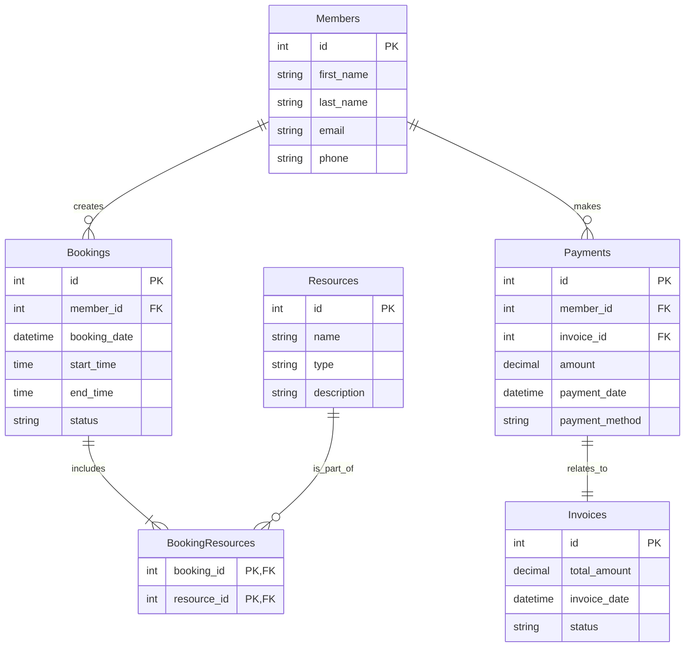

## Esercizio

### Testo

Una startup tecnologica desidera sviluppare una piattaforma mobile per la gestione delle risorse condivise all'interno degli spazi di coworking, al fine di migliorare l'efficienza e la collaborazione tra i membri.

Ogni membro, dopo aver completato la registrazione sulla piattaforma, può gestire la propria disponibilità per prenotare spazi di lavoro, sale riunioni e attrezzature, specificando le preferenze orarie e le risorse necessarie.

La piattaforma include un elenco delle risorse disponibili nello spazio di coworking (es: scrivanie, proiettori, stampanti 3D). Ogni membro può selezionare una o più risorse per soddisfare le proprie esigenze di lavoro.

Per ogni prenotazione, il sistema verifica la disponibilità delle risorse selezionate e conferma la prenotazione, inviando notifiche sia al membro che agli amministratori dello spazio.

Il sistema gestisce anche i pagamenti effettuati dai membri per l'utilizzo delle risorse prenotate. Ogni pagamento viene registrato e associato a una fattura emessa al membro. Le fatture includono il totale degli importi dovuti e lo stato del pagamento.

### Compito

1. **Progettazione Concettuale:**

   - Crea un diagramma ER che rappresenti questo scenario.
   - Identifica le entità, gli attributi e le relazioni.
   - Specifica la cardinalità delle relazioni.
   - Analizza il testo e giustifica le tue scelte.

2. **Progettazione Logica:**

   - Traduci il diagramma ER in uno schema relazionale.
   - Definisci le tabelle e le colonne.
   - Individua le chiavi primarie (PK) e le chiavi esterne (FK) per mantenere l'integrità dei dati.

3. **Normalizzazione:**

   - Normalizza il modello logico del database per rispettare la Prima Forma Normale (1NF), la Seconda Forma Normale (2NF) e la Terza Forma Normale (3NF).

4. **Creazione delle Tabelle in SQL:**

   - Scrivi le istruzioni SQL per creare le tabelle normalizzate.

5. **Inserimento dei Dati in SQL:**
   - Scrivi le istruzioni SQL per inserire alcuni dati di esempio nelle tabelle create.

### Svolgimento

### Considerazioni sul testo dell'esercizio

1. **Sistema di Notifiche**

   - Le notifiche sono eventi effimeri e transitori
   - Non è necessario memorizzarle permanentemente nel database
   - Dovrebbero essere gestite a livello applicativo attraverso un sistema di messaggistica

2. **Gestione delle Prenotazioni**

   - È necessario implementare un sistema di verifica della disponibilità delle risorse
   - Deve essere gestita la concorrenza per evitare conflitti nelle prenotazioni
   - Lo stato della prenotazione deve tracciare l'intero ciclo di vita (es: pending, confirmed, cancelled)

3. **Sistema di Pagamento**
   - I pagamenti e le fatture sono strettamente correlati (relazione 1:1)
   - Ogni pagamento è associato a una specifica fattura
   - Non è necessaria una relazione diretta tra Members e Invoices poiché è già implicita attraverso i Payments

### Modello ER



### Schema Logico

Di seguito lo schema logico della base di dati, con le chiavi primarie sottolineate e le chiavi esterne indicate con FK:

- Members(**id**, first_name, last_name, email, phone)
- Resources(**id**, name, type, description)
- Bookings(**id**, member_id[FK], booking_date, start_time, end_time, status)
- BookingResources(**booking_id[FK]**, **resource_id[FK]**)
- Payments(**id**, member_id[FK], amount, payment_date, payment_method, invoice_id[FK])
- Invoices(**id**, total_amount, invoice_date, status)

### Normalizzazione

1. **Prima Forma Normale (1NF)**

   - Assicurarsi che ogni colonna contenga solo valori atomici e che ogni tabella abbia una chiave primaria.

2. **Seconda Forma Normale (2NF)**

   - Assicurarsi che tutte le colonne non chiave dipendano interamente dalla chiave primaria.

3. **Terza Forma Normale (3NF)**
   - Assicurarsi che tutte le colonne non chiave dipendano solo dalla chiave primaria e non da altre colonne non chiave.

### Creazione delle Tabelle in SQL

```sql
CREATE TABLE Members (
    id INT PRIMARY KEY,
    first_name VARCHAR(50),
    last_name VARCHAR(50),
    email VARCHAR(100),
    phone VARCHAR(20)
);

CREATE TABLE Resources (
    id INT PRIMARY KEY,
    name VARCHAR(100),
    type VARCHAR(50),
    description TEXT
);

CREATE TABLE Bookings (
    id INT PRIMARY KEY,
    member_id INT,
    booking_date DATETIME,
    start_time TIME,
    end_time TIME,
    status VARCHAR(20),
    FOREIGN KEY (member_id) REFERENCES Members(id)
);

CREATE TABLE BookingResources (
    booking_id INT,
    resource_id INT,
    PRIMARY KEY (booking_id, resource_id),
    FOREIGN KEY (booking_id) REFERENCES Bookings(id),
    FOREIGN KEY (resource_id) REFERENCES Resources(id)
);

CREATE TABLE Payments (
    id INT PRIMARY KEY,
    member_id INT,
    amount DECIMAL(10, 2),
    payment_date DATETIME,
    payment_method VARCHAR(50),
    invoice_id INT,
    FOREIGN KEY (member_id) REFERENCES Members(id),
    FOREIGN KEY (invoice_id) REFERENCES Invoices(id)
);

CREATE TABLE Invoices (
    id INT PRIMARY KEY,
    total_amount DECIMAL(10, 2),
    invoice_date DATETIME,
    status VARCHAR(20)
);
```

### Inserimento dei Dati in SQL

```sql
INSERT INTO Members (id, first_name, last_name, email, phone) VALUES
(1, 'Mario', 'Rossi', 'mario.rossi@example.com', '1234567890'),
(2, 'Luigi', 'Verdi', 'luigi.verdi@example.com', '0987654321');

INSERT INTO Resources (id, name, type, description) VALUES
(1, 'Scrivania 1', 'Scrivania', 'Scrivania vicino alla finestra'),
(2, 'Proiettore 1', 'Proiettore', 'Proiettore HD');

INSERT INTO Bookings (id, member_id, booking_date, start_time, end_time, status) VALUES
(1, 1, '2023-10-01 10:00:00', '10:00:00', '12:00:00', 'confirmed'),
(2, 2, '2023-10-01 14:00:00', '14:00:00', '16:00:00', 'pending');

INSERT INTO BookingResources (booking_id, resource_id) VALUES
(1, 1),
(2, 2);

INSERT INTO Payments (id, member_id, amount, payment_date, payment_method, invoice_id) VALUES
(1, 1, 50.00, '2023-10-01 12:00:00', 'Credit Card', 1),
(2, 2, 30.00, '2023-10-01 16:00:00', 'PayPal', 2);

INSERT INTO Invoices (id, total_amount, invoice_date, status) VALUES
(1, 50.00, '2023-10-01 12:00:00', 'paid'),
(2, 30.00, '2023-10-01 16:00:00', 'unpaid');
```
