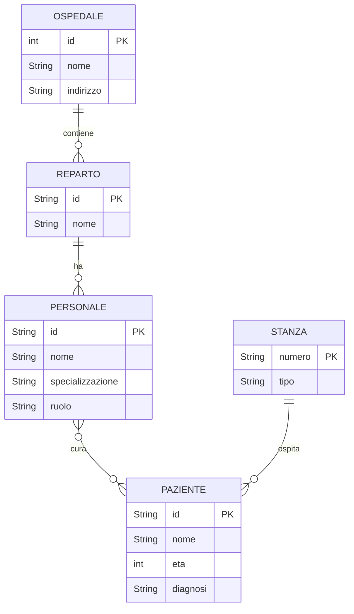

```mermaid
erDiagram
    OSPEDALE {
        int id PK
        String nome
        String indirizzo
    }

    REPARTO {
        String id PK
        String nome
    }
    PERSONALE {
        String id PK
        String nome
        String specializzazione
        String ruolo
    }
    PAZIENTE {
        String id PK
        String nome
        int eta
        String diagnosi
    }
    STANZA {
        String numero PK
        String tipo
    }

    OSPEDALE ||--o{ REPARTO : contiene
    REPARTO ||--o{ PERSONALE : ha
    PERSONALE }o--o{ PAZIENTE : cura
    STANZA ||--o{ PAZIENTE : ospita
```
