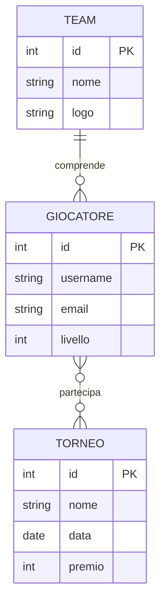

## Esercizio

Questo sistema gestisce tornei competitivi di _League of Legends_, uno dei più popolari videogiochi MOBA (Multiplayer Online Battle Arena).

## Struttura del Sistema

- I **Team** sono organizzazioni professionali di ESports con proprio logo e brand (es. Phoenix Gaming, Dragon Esports)
- I **Giocatori** sono atleti professionisti con:
  - Username utilizzato nelle competizioni
  - Email per le comunicazioni ufficiali
  - Livello di abilità (0-100) basato sulle prestazioni
- I **Tornei** sono competizioni ufficiali caratterizzate da:
  - Nome dell'evento
  - Data di svolgimento
  - Montepremi in euro

## Relazioni

- Ogni giocatore appartiene a un solo team
- I giocatori possono partecipare a più tornei durante la stagione
- I team competono nei tornei attraverso i loro giocatori

Il database traccia le partecipazioni ai tornei e permette di gestire le statistiche delle competizioni nella scena ESports italiana.

Dato il modello ER



## Compito

1. Crea il database usando Sqlite.
2. Crea una applicazione Flask con le seguenti pagine:
   - `/`: buttons con link alle altre pagine
   - `/tornei`: mostra una tabella con la lista dei tornei ordinata per premio
   - `/teams`: mostra una tabella con la lista dei team ordinata alfabeticamente
   - `/torneo/<int:id>`: lista dei giocatori che partecipano al torneo
3. Crea una pagina `/query` con il risultato delle seguenti query
   - Somma dei premi di tutti i tornei
   - Numero di giocatori per ogni team
   - Nome del team del giocatore con livello più alto

```sql
-- Creazione della tabella TEAM
CREATE TABLE TEAM (
    id INTEGER PRIMARY KEY AUTOINCREMENT,
    nome VARCHAR(100) NOT NULL UNIQUE,
    logo VARCHAR(255) NOT NULL
);

-- Creazione della tabella GIOCATORE
CREATE TABLE GIOCATORE (
    id INTEGER PRIMARY KEY AUTOINCREMENT,
    username VARCHAR(50) NOT NULL UNIQUE,
    email VARCHAR(100) NOT NULL UNIQUE,
    livello INTEGER NOT NULL CHECK (livello >= 0 AND livello <= 100),
    team_id INTEGER NOT NULL,
    FOREIGN KEY (team_id) REFERENCES TEAM(id)
);

-- Creazione della tabella TORNEO
CREATE TABLE TORNEO (
    id INTEGER PRIMARY KEY AUTOINCREMENT,
    nome VARCHAR(100) NOT NULL UNIQUE,
    data DATE NOT NULL,
    premio INTEGER NOT NULL CHECK (premio >= 0),
    CONSTRAINT data_futura CHECK (data >= CURRENT_DATE)
);

-- Creazione della tabella ponte per la relazione N:N tra GIOCATORE e TORNEO
CREATE TABLE GIOCATORE_TORNEO (
    giocatore_id INTEGER,
    torneo_id INTEGER,
    PRIMARY KEY (giocatore_id, torneo_id),
    FOREIGN KEY (giocatore_id) REFERENCES GIOCATORE(id),
    FOREIGN KEY (torneo_id) REFERENCES TORNEO(id)
);


-- Inserimento dati nella tabella TEAM
INSERT INTO TEAM (id, nome, logo) VALUES
(1, 'Phoenix Gaming', 'phoenix.png'),
(2, 'Dragon Esports', 'dragon.png'),
(3, 'Ninja Squad', 'ninja.png'),
(4, 'Eagle Team', 'eagle.png');

-- Inserimento dati nella tabella GIOCATORE
INSERT INTO GIOCATORE (id, username, email, livello, team_id) VALUES
(1, 'ProGamer1', 'pro1@gaming.com', 75, 1),
(2, 'NinjaX', 'ninja@gaming.com', 82, 3),
(3, 'DragonSlayer', 'dragon@gaming.com', 65, 2),
(4, 'EagleEye', 'eagle@gaming.com', 90, 4),
(5, 'PhoenixRider', 'phoenix@gaming.com', 78, 1),
(6, 'ShadowNinja', 'shadow@gaming.com', 85, 3);

-- Inserimento dati nella tabella TORNEO
INSERT INTO TORNEO (id, nome, data, premio) VALUES
(1, 'Summer Championship', '2024-06-15', 5000),
(2, 'Winter Cup', '2024-12-20', 7500),
(3, 'Pro League Finals', '2024-09-01', 10000),
(4, 'Regional Qualifier', '2024-03-30', 3000);

-- Inserimento dati nella tabella ponte GIOCATORE_TORNEO
INSERT INTO GIOCATORE_TORNEO (giocatore_id, torneo_id) VALUES
(1, 1), -- ProGamer1 partecipa a Summer Championship
(1, 2), -- ProGamer1 partecipa a Winter Cup
(2, 1), -- NinjaX partecipa a Summer Championship
(2, 3), -- NinjaX partecipa a Pro League Finals
(3, 2), -- DragonSlayer partecipa a Winter Cup
(4, 1), -- EagleEye partecipa a Summer Championship
(4, 2), -- EagleEye partecipa a Winter Cup
(4, 3), -- EagleEye partecipa a Pro League Finals
(5, 3), -- PhoenixRider partecipa a Pro League Finals
(6, 1), -- ShadowNinja partecipa a Summer Championship
(6, 4); -- ShadowNinja partecipa a Regional Qualifier
```
