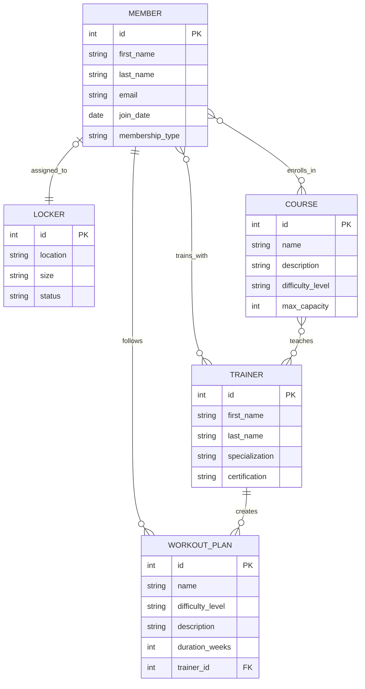

## Esercizio

### Testo

Una catena di palestre necessita di un sistema di gestione per le sue attività quotidiane. Il sistema deve gestire le informazioni relative ai membri, agli allenatori, ai corsi di gruppo e ai piani di allenamento personalizzati.

Ogni membro, al momento dell'iscrizione, viene registrato con i propri dati personali, inclusi nome, cognome, email e tipo di abbonamento. Ad ogni membro viene assegnato un armadietto personale, identificato da un numero univoco e caratterizzato da posizione e dimensione.

La palestra offre diversi corsi di gruppo, ciascuno con un nome, una descrizione, un livello di difficoltà e una capacità massima di partecipanti. I corsi sono programmati in specifici giorni e orari della settimana.

Gli allenatori professionisti della palestra sono registrati con le loro credenziali professionali, incluse le certificazioni e le specializzazioni. Ogni allenatore può seguire più membri e creare piani di allenamento personalizzati. I membri possono allenarsi con diversi allenatori in base alle loro esigenze.

I piani di allenamento hanno un nome, una descrizione dettagliata, un livello di difficoltà e una durata prevista in settimane. Un membro può seguire più piani di allenamento nel tempo.

### Compito

1. **Progettazione Concettuale:**

   - Crea un diagramma ER che rappresenti questo scenario.
   - Identifica le entità, gli attributi e le relazioni.
   - Specifica la cardinalità delle relazioni.
   - Analizza il testo e giustifica le tue scelte.

2. **Progettazione Logica:**

   - Traduci il diagramma ER in uno schema relazionale.
   - Definisci le tabelle e le colonne.
   - Individua le chiavi primarie (PK) e le chiavi esterne (FK) per mantenere l'integrità dei dati.

3. **Normalizzazione:**

   - Normalizza il modello logico del database per rispettare la Prima Forma Normale (1NF), la Seconda Forma Normale (2NF) e la Terza Forma Normale (3NF).

4. **Creazione delle Tabelle in SQL:**

   - Scrivi le istruzioni SQL per creare le tabelle normalizzate.

5. **Inserimento dei Dati in SQL:**
   - Scrivi le istruzioni SQL per inserire alcuni dati di esempio nelle tabelle create.

### Considerazioni sul testo dell'esercizio

1. **Relazione Membro-Armadietto (1:1)**

   - Ogni membro può avere al massimo un armadietto assegnato
   - Ogni armadietto può essere assegnato a un solo membro
   - È una relazione uno a uno opzionale dal lato del membro

2. **Relazione Membro-Trainer (N:N)**

   - Un membro può allenarsi con più trainer
   - Un trainer può allenare più membri
   - Richiede una tabella di associazione

3. **Corsi e Trainer**
   - I corsi possono essere tenuti da più trainer
   - Un trainer può insegnare più corsi
   - La relazione è molti a molti opzionale da entrambi i lati

### Modello ER



### Schema Logico

Di seguito lo schema logico della base di dati, con le chiavi primarie sottolineate e le chiavi esterne indicate con FK:

- MEMBER(**id**, first_name, last_name, email, join_date, membership_type)
- LOCKER(**id**, location, size, status, member_id[FK])
- TRAINER(**id**, first_name, last_name, specialization, certification)
- WORKOUT_PLAN(**id**, name, difficulty_level, description, duration_weeks, trainer_id[FK])
- MEMBER_TRAINER(**member_id[FK]**, **trainer_id[FK]**)
- MEMBER_WORKOUT(**member_id[FK]**, **workout_plan_id[FK]**)
- COURSE(**id**, name, description, difficulty_level, max_capacity)
- TRAINER_COURSE(**trainer_id[FK]**, **course_id[FK]**)
- MEMBER_COURSE(**member_id[FK]**, **course_id[FK]**)

### Normalizzazione

1. **Prima Forma Normale (1NF)**

   - Tutte le tabelle hanno una chiave primaria
   - Tutti gli attributi contengono valori atomici
   - Non ci sono gruppi di valori ripetuti

2. **Seconda Forma Normale (2NF)**

   - Le tabelle sono in 1NF
   - Gli attributi non chiave dipendono dall'intera chiave primaria
   - Le tabelle di associazione (MEMBER_TRAINER, MEMBER_COURSE, TRAINER_COURSE) sono già in 2NF

3. **Terza Forma Normale (3NF)**
   - Le tabelle sono in 2NF
   - Non ci sono dipendenze transitive
   - Ogni attributo dipende solo dalla chiave primaria

### Creazione delle Tabelle in SQL

```sql
CREATE TABLE MEMBER (
    id INT PRIMARY KEY,
    first_name VARCHAR(50),
    last_name VARCHAR(50),
    email VARCHAR(100) UNIQUE,
    join_date DATE,
    membership_type VARCHAR(20)
);

CREATE TABLE LOCKER (
    id INT PRIMARY KEY,
    location VARCHAR(50),
    size VARCHAR(20),
    status VARCHAR(20),
    member_id INT UNIQUE,
    FOREIGN KEY (member_id) REFERENCES MEMBER(id)
);

CREATE TABLE TRAINER (
    id INT PRIMARY KEY,
    first_name VARCHAR(50),
    last_name VARCHAR(50),
    specialization VARCHAR(100),
    certification VARCHAR(100)
);

CREATE TABLE WORKOUT_PLAN (
    id INT PRIMARY KEY,
    name VARCHAR(100),
    difficulty_level VARCHAR(20),
    description TEXT,
    duration_weeks INT,
    trainer_id INT,
    FOREIGN KEY (trainer_id) REFERENCES TRAINER(id)
);

CREATE TABLE MEMBER_TRAINER (
    member_id INT,
    trainer_id INT,
    PRIMARY KEY (member_id, trainer_id),
    FOREIGN KEY (member_id) REFERENCES MEMBER(id),
    FOREIGN KEY (trainer_id) REFERENCES TRAINER(id)
);

CREATE TABLE MEMBER_WORKOUT (
    member_id INT,
    workout_plan_id INT,
    PRIMARY KEY (member_id, workout_plan_id),
    FOREIGN KEY (member_id) REFERENCES MEMBER(id),
    FOREIGN KEY (workout_plan_id) REFERENCES WORKOUT_PLAN(id)
);

CREATE TABLE COURSE (
    id INT PRIMARY KEY,
    name VARCHAR(100),
    description TEXT,
    difficulty_level VARCHAR(20),
    max_capacity INT
);

CREATE TABLE TRAINER_COURSE (
    trainer_id INT,
    course_id INT,
    PRIMARY KEY (trainer_id, course_id),
    FOREIGN KEY (trainer_id) REFERENCES TRAINER(id),
    FOREIGN KEY (course_id) REFERENCES COURSE(id)
);

CREATE TABLE MEMBER_COURSE (
    member_id INT,
    course_id INT,
    PRIMARY KEY (member_id, course_id),
    FOREIGN KEY (member_id) REFERENCES MEMBER(id),
    FOREIGN KEY (course_id) REFERENCES COURSE(id)
);
```

### Inserimento dei Dati in SQL

```sql
INSERT INTO MEMBER (id, first_name, last_name, email, join_date, membership_type) VALUES
(1, 'Mario', 'Rossi', 'mario.rossi@email.com', '2024-01-15', 'premium'),
(2, 'Laura', 'Bianchi', 'laura.bianchi@email.com', '2024-02-01', 'standard');

INSERT INTO LOCKER (id, location, size, status, member_id) VALUES
(1, 'Piano 1', 'medium', 'active', 1),
(2, 'Piano 2', 'large', 'active', NULL);

INSERT INTO TRAINER (id, first_name, last_name, specialization, certification) VALUES
(1, 'Giuseppe', 'Verdi', 'Personal Training', 'ISSA Certified'),
(2, 'Anna', 'Neri', 'Yoga', 'RYT-200');

INSERT INTO WORKOUT_PLAN (id, name, difficulty_level, description, duration_weeks, trainer_id) VALUES
(1, 'Principiante Total Body', 'beginner', 'Piano di allenamento completo per principianti', 8, 1),
(2, 'Power Yoga Flow', 'intermediate', 'Sequenza di yoga dinamico', 6, 2);

INSERT INTO MEMBER_TRAINER (member_id, trainer_id) VALUES
(1, 1),
(2, 2);

INSERT INTO COURSE (id, name, description, difficulty_level, max_capacity) VALUES
(1, 'Yoga Mattutino', 'Sessione di yoga per iniziare la giornata', 'all-levels', 15),
(2, 'HIIT', 'Allenamento ad alta intensità', 'advanced', 12);

INSERT INTO TRAINER_COURSE (trainer_id, course_id) VALUES
(2, 1),
(1, 2);

INSERT INTO MEMBER_COURSE (member_id, course_id) VALUES
(1, 2),
(2, 1);

INSERT INTO MEMBER_WORKOUT (member_id, workout_plan_id) VALUES
(1, 1),
(2, 2);
```
