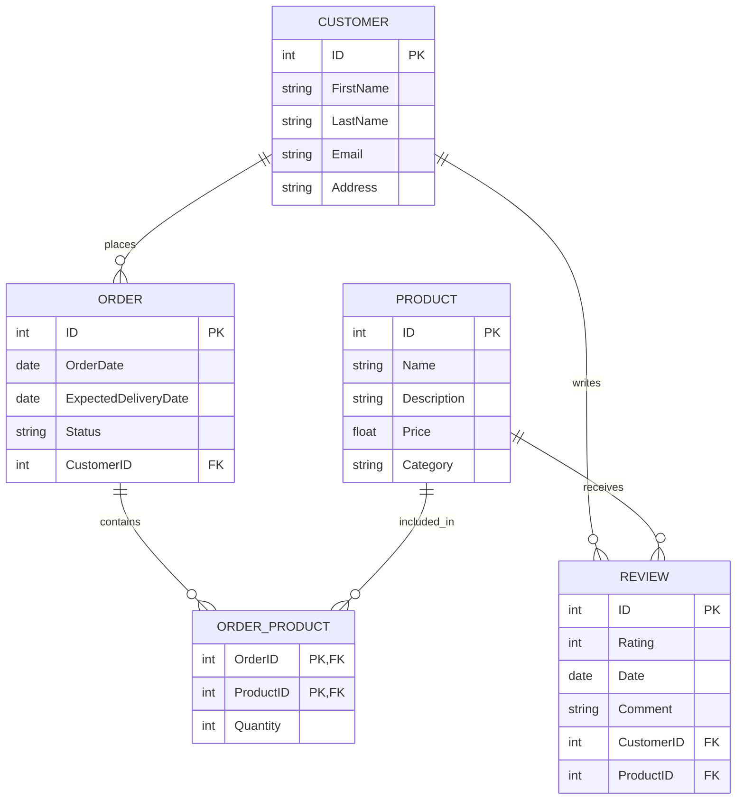

### Esempio di Soluzione

#### Progettazione Concettuale



#### Progettazione Logica


#### Tabelle

- **PRODUCT**: id `PK`, name, description, price, category
- **CUSTOMER**: id `PK`, first_name, last_name, email, address
- **ORDER**: id `PK`, order_date, delivery_date, status, customer_id `FK` → CUSTOMER.id
- **REVIEW**: id `PK`, rating, review_date, comment, customer_id `FK` → CUSTOMER.id, product_id `FK` → PRODUCT.id
- **ORDER_PRODUCT**: order_id `FK` → ORDER.id, product_id `FK` → PRODUCT.id, quantity, `PK`(order_id, product_id)

### Creazione delle Tabelle in SQL

```sql
CREATE TABLE PRODUCT (
    id INT PRIMARY KEY,
    name VARCHAR(255),
    description TEXT,
    price DECIMAL(10, 2),
    category VARCHAR(255)
);

CREATE TABLE CUSTOMER (
    id INT PRIMARY KEY,
    first_name VARCHAR(255),
    last_name VARCHAR(255),
    email VARCHAR(255),
    address TEXT
);

CREATE TABLE `ORDER` (
    id INT PRIMARY KEY,
    order_date DATE,
    delivery_date DATE,
    status VARCHAR(50),
    customer_id INT,
    FOREIGN KEY (customer_id) REFERENCES CUSTOMER(id)
);

CREATE TABLE REVIEW (
    id INT PRIMARY KEY,
    rating INT,
    review_date DATE,
    comment TEXT,
    customer_id INT,
    product_id INT,
    FOREIGN KEY (customer_id) REFERENCES CUSTOMER(id),
    FOREIGN KEY (product_id) REFERENCES PRODUCT(id)
);

CREATE TABLE ORDER_PRODUCT (
    order_id INT,
    product_id INT,
    quantity INT,
    PRIMARY KEY (order_id, product_id),
    FOREIGN KEY (order_id) REFERENCES `ORDER`(id),
    FOREIGN KEY (product_id) REFERENCES PRODUCT(id)
);
```

### Inserimento dei Dati in SQL

```sql
INSERT INTO PRODUCT (id, name, description, price, category) VALUES
(1, 'Laptop', 'High performance laptop', 999.99, 'Electronics'),
(2, 'Smartphone', 'Latest model smartphone', 699.99, 'Electronics');

INSERT INTO CUSTOMER (id, first_name, last_name, email, address) VALUES
(1, 'John', 'Doe', 'john.doe@example.com', '123 Main St'),
(2, 'Jane', 'Smith', 'jane.smith@example.com', '456 Elm St');

INSERT INTO `ORDER` (id, order_date, delivery_date, status, customer_id) VALUES
(1, '2023-01-01', '2023-01-05', 'shipped', 1),
(2, '2023-01-02', '2023-01-06', 'processing', 2);

INSERT INTO REVIEW (id, rating, review_date, comment, customer_id, product_id) VALUES
(1, 5, 'Excellent product!', '2023-01-10', 1, 1),
(2, 4, 'Very good, but a bit expensive.', '2023-01-11', 2, 2);

INSERT INTO ORDER_PRODUCT (order_id, product_id, quantity) VALUES
(1, 1, 1),
(2, 2, 2);
```