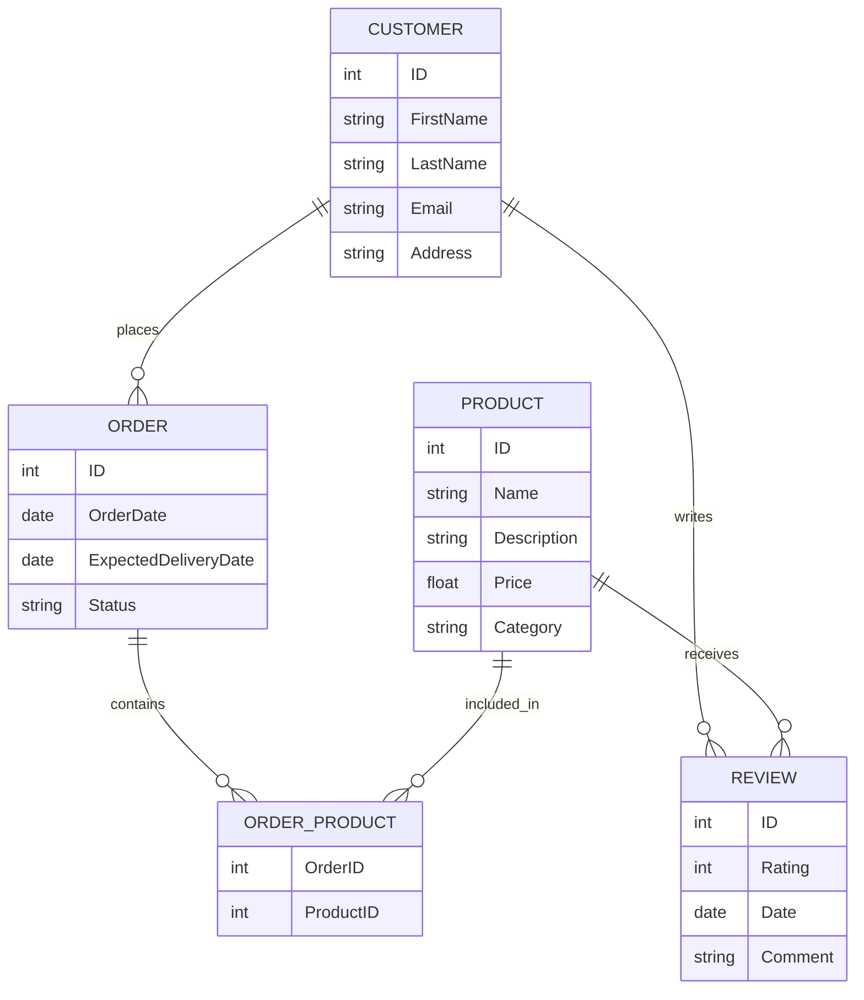

```mermaid
erDiagram
    PRODUCT {
        int ID
        string Name
        string Description
        float Price
        string Category
    }
    CUSTOMER {
        int ID
        string FirstName
        string LastName
        string Email
        string Address
    }
    ORDER {
        int ID
        date OrderDate
        date ExpectedDeliveryDate
        string Status
    }
    REVIEW {
        int ID
        int Rating
        date Date
        string Comment
    }
    ORDER_PRODUCT {
        int OrderID
        int ProductID
    }

    CUSTOMER ||--o{ ORDER : places
    ORDER ||--o{ ORDER_PRODUCT : contains
    PRODUCT ||--o{ ORDER_PRODUCT : included_in
    CUSTOMER ||--o{ REVIEW : writes
    PRODUCT ||--o{ REVIEW : receives
```
