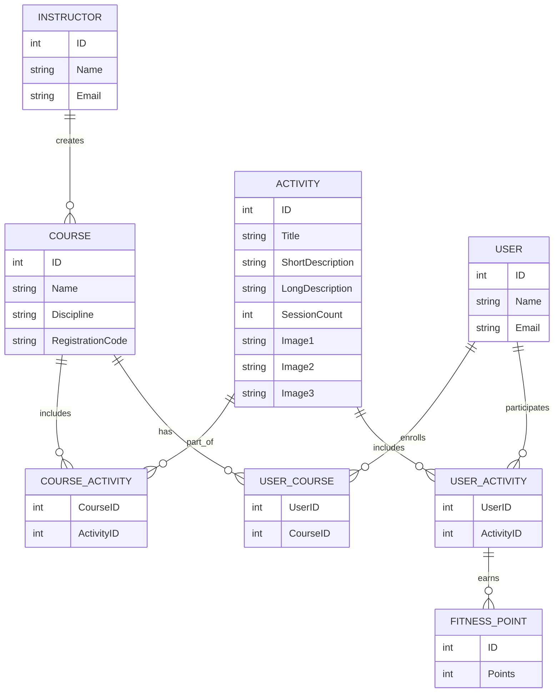

### Esempio di Soluzione

#### Progettazione Concettuale

```mermaid
erDiagram
    INSTRUCTOR {
        int ID
        string Name
        string Email
    }
    COURSE {
        int ID
        string Name
        string Discipline
        string RegistrationCode
    }
    ACTIVITY {
        int ID
        string Title
        string ShortDescription
        string LongDescription
        int SessionCount
        string Image1
        string Image2
        string Image3
    }
    USER {
        int ID
        string Name
        string Email
    }
    FITNESS_POINT {
        int ID
        int Points
    }
    COURSE_ACTIVITY {
        int CourseID
        int ActivityID
    }
    USER_COURSE {
        int UserID
        int CourseID
    }
    USER_ACTIVITY {
        int UserID
        int ActivityID
    }

    INSTRUCTOR ||--o{ COURSE : creates
    COURSE ||--o{ COURSE_ACTIVITY : includes
    ACTIVITY ||--o{ COURSE_ACTIVITY : part_of
    USER ||--o{ USER_COURSE : enrolls
    COURSE ||--o{ USER_COURSE : has
    USER ||--o{ USER_ACTIVITY : participates
    ACTIVITY ||--o{ USER_ACTIVITY : includes
    USER_ACTIVITY ||--o{ FITNESS_POINT : earns
```
