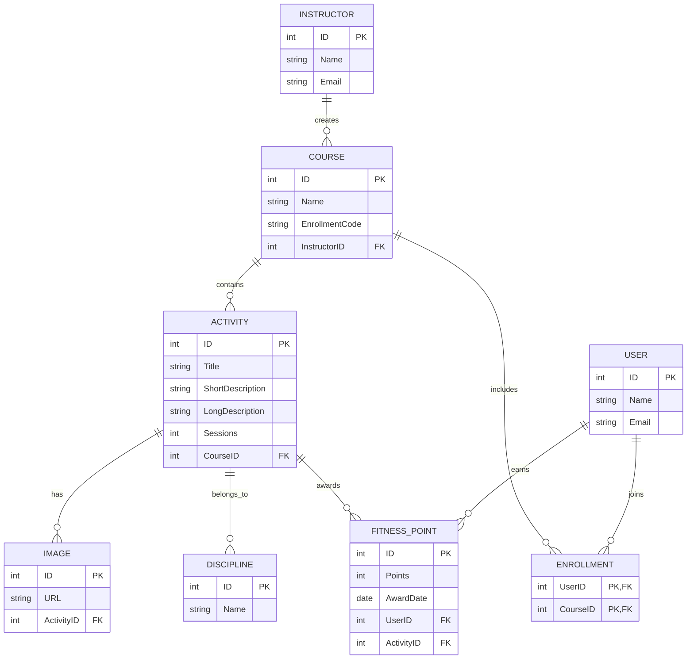

### Esempio di Soluzione per l'Esercizio 6

#### Progettazione Concettuale



#### Progettazione Logica

#### Tabelle

- **INSTRUCTOR**: id `PK`, name, email
- **COURSE**: id `PK`, name, enrollment_code, instructor_id `FK` → INSTRUCTOR.id
- **ACTIVITY**: id `PK`, title, short_description, long_description, sessions, course_id `FK` → COURSE.id
- **USER**: id `PK`, name, email
- **IMAGE**: id `PK`, url, activity_id `FK` → ACTIVITY.id
- **DISCIPLINE**: id `PK`, name
- **ENROLLMENT**: user_id `FK` → USER.id, course_id `FK` → COURSE.id, `PK`(user_id, course_id)
- **FITNESS_POINT**: id `PK`, points, award_date, user_id `FK` → USER.id, activity_id `FK` → ACTIVITY.id

### Creazione delle Tabelle in SQL

```sql
CREATE TABLE INSTRUCTOR (
    id INT PRIMARY KEY,
    name VARCHAR(255),
    email VARCHAR(255)
);

CREATE TABLE COURSE (
    id INT PRIMARY KEY,
    name VARCHAR(255),
    enrollment_code VARCHAR(255),
    instructor_id INT,
    FOREIGN KEY (instructor_id) REFERENCES INSTRUCTOR(id)
);

CREATE TABLE ACTIVITY (
    id INT PRIMARY KEY,
    title VARCHAR(255),
    short_description VARCHAR(160),
    long_description TEXT,
    sessions INT,
    course_id INT,
    FOREIGN KEY (course_id) REFERENCES COURSE(id)
);

CREATE TABLE USER (
    id INT PRIMARY KEY,
    name VARCHAR(255),
    email VARCHAR(255)
);

CREATE TABLE IMAGE (
    id INT PRIMARY KEY,
    url VARCHAR(255),
    activity_id INT,
    FOREIGN KEY (activity_id) REFERENCES ACTIVITY(id)
);

CREATE TABLE DISCIPLINE (
    id INT PRIMARY KEY,
    name VARCHAR(255)
);

CREATE TABLE ENROLLMENT (
    user_id INT,
    course_id INT,
    PRIMARY KEY (user_id, course_id),
    FOREIGN KEY (user_id) REFERENCES USER(id),
    FOREIGN KEY (course_id) REFERENCES COURSE(id)
);

CREATE TABLE FITNESS_POINT (
    id INT PRIMARY KEY,
    points INT,
    award_date DATE,
    user_id INT,
    activity_id INT,
    FOREIGN KEY (user_id) REFERENCES USER(id),
    FOREIGN KEY (activity_id) REFERENCES ACTIVITY(id)
);
```

### Inserimento dei Dati in SQL

```sql
INSERT INTO INSTRUCTOR (id, name, email) VALUES
(1, 'John Smith', 'john.smith@example.com'),
(2, 'Jane Doe', 'jane.doe@example.com');

INSERT INTO COURSE (id, name, enrollment_code, instructor_id) VALUES
(1, 'Yoga Basics', 'YOGA101', 1),
(2, 'Advanced Soccer', 'SOCCER201', 2);

INSERT INTO ACTIVITY (id, title, short_description, long_description, sessions, course_id) VALUES
(1, 'Morning Yoga', 'Basic yoga poses for beginners', 'Detailed description of yoga poses...', 10, 1),
(2, 'Soccer Training', 'Soccer drills and techniques', 'Detailed soccer training plan...', 12, 2);

INSERT INTO USER (id, name, email) VALUES
(1, 'Alice Johnson', 'alice@example.com'),
(2, 'Bob Wilson', 'bob@example.com');

INSERT INTO IMAGE (id, url, activity_id) VALUES
(1, 'yoga1.jpg', 1),
(2, 'soccer1.jpg', 2);

INSERT INTO DISCIPLINE (id, name) VALUES
(1, 'Yoga'),
(2, 'Soccer');

INSERT INTO ENROLLMENT (user_id, course_id) VALUES
(1, 1),
(2, 2);

INSERT INTO FITNESS_POINT (id, points, award_date, user_id, activity_id) VALUES
(1, 10, '2023-01-10', 1, 1),
(2, 15, '2023-01-15', 2, 2);
```