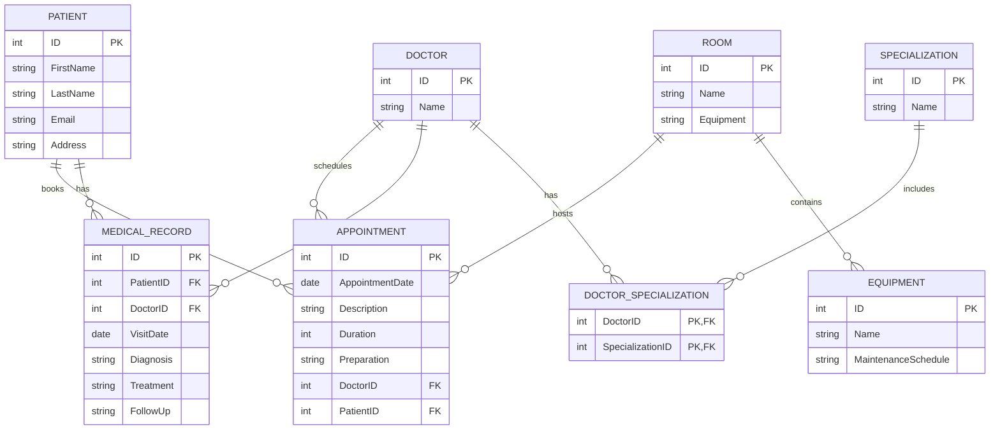

### Esempio di Soluzione

#### Progettazione Concettuale



#### Progettazione Logica

#### Tabelle

- **DOCTOR**: id `PK`, name, specializations
- **PATIENT**: id `PK`, first_name, last_name, email, address
- **APPOINTMENT**: id `PK`, appointment_date, description, duration, preparation, doctor_id `FK` → DOCTOR.id, patient_id `FK` → PATIENT.id
- **MEDICAL_RECORD**: id `PK`, patient_id `FK` → PATIENT.id, doctor_id `FK` → DOCTOR.id, visit_date, diagnosis, treatment, follow_up
- **SPECIALIZATION**: id `PK`, name
- **DOCTOR_SPECIALIZATION**: doctor_id `FK` → DOCTOR.id, specialization_id `FK` → SPECIALIZATION.id, `PK`(doctor_id, specialization_id)
- **ROOM**: id `PK`, name, equipment
- **EQUIPMENT**: id `PK`, name, maintenance_schedule

### Creazione delle Tabelle in SQL

```sql
CREATE TABLE DOCTOR (
    id INT PRIMARY KEY,
    name VARCHAR(255),
    specializations TEXT
);

CREATE TABLE PATIENT (
    id INT PRIMARY KEY,
    first_name VARCHAR(255),
    last_name VARCHAR(255),
    email VARCHAR(255),
    address TEXT
);

CREATE TABLE APPOINTMENT (
    id INT PRIMARY KEY,
    appointment_date DATE,
    description TEXT,
    duration INT,
    preparation TEXT,
    doctor_id INT,
    patient_id INT,
    FOREIGN KEY (doctor_id) REFERENCES DOCTOR(id),
    FOREIGN KEY (patient_id) REFERENCES PATIENT(id)
);

CREATE TABLE MEDICAL_RECORD (
    id INT PRIMARY KEY,
    patient_id INT,
    doctor_id INT,
    visit_date DATE,
    diagnosis TEXT,
    treatment TEXT,
    follow_up TEXT,
    FOREIGN KEY (patient_id) REFERENCES PATIENT(id),
    FOREIGN KEY (doctor_id) REFERENCES DOCTOR(id)
);

CREATE TABLE SPECIALIZATION (
    id INT PRIMARY KEY,
    name VARCHAR(255)
);

CREATE TABLE DOCTOR_SPECIALIZATION (
    doctor_id INT,
    specialization_id INT,
    PRIMARY KEY (doctor_id, specialization_id),
    FOREIGN KEY (doctor_id) REFERENCES DOCTOR(id),
    FOREIGN KEY (specialization_id) REFERENCES SPECIALIZATION(id)
);

CREATE TABLE ROOM (
    id INT PRIMARY KEY,
    name VARCHAR(255),
    equipment TEXT
);

CREATE TABLE EQUIPMENT (
    id INT PRIMARY KEY,
    name VARCHAR(255),
    maintenance_schedule TEXT
);
```

### Inserimento dei Dati in SQL

```sql
INSERT INTO DOCTOR (id, name, specializations) VALUES
(1, 'Dr. John Smith', 'Cardiology, Dermatology'),
(2, 'Dr. Jane Doe', 'Orthopedics, Pediatrics');

INSERT INTO PATIENT (id, first_name, last_name, email, address) VALUES
(1, 'Alice', 'Johnson', 'alice.johnson@example.com', '123 Main St'),
(2, 'Bob', 'Brown', 'bob.brown@example.com', '456 Elm St');

INSERT INTO APPOINTMENT (id, appointment_date, description, duration, preparation, doctor_id, patient_id) VALUES
(1, '2023-01-01', 'Routine check-up', 30, 'None', 1, 1),
(2, '2023-01-02', 'Follow-up visit', 45, 'Fasting required', 2, 2);

INSERT INTO MEDICAL_RECORD (id, patient_id, doctor_id, visit_date, diagnosis, treatment, follow_up) VALUES
(1, 1, 1, '2023-01-01', 'Healthy', 'None', 'Annual check-up'),
(2, 2, 2, '2023-01-02', 'Minor injury', 'Rest and medication', 'Follow-up in 2 weeks');

INSERT INTO SPECIALIZATION (id, name) VALUES
(1, 'Cardiology'),
(2, 'Dermatology'),
(3, 'Orthopedics'),
(4, 'Pediatrics');

INSERT INTO DOCTOR_SPECIALIZATION (doctor_id, specialization_id) VALUES
(1, 1),
(1, 2),
(2, 3),
(2, 4);

INSERT INTO ROOM (id, name, equipment) VALUES
(1, 'Room 101', 'EKG Machine, Ultrasound'),
(2, 'Room 102', 'X-Ray Machine, MRI');

INSERT INTO EQUIPMENT (id, name, maintenance_schedule) VALUES
(1, 'EKG Machine', 'Monthly'),
(2, 'Ultrasound', 'Quarterly'),
(3, 'X-Ray Machine', 'Bi-Annually'),
(4, 'MRI', 'Annually');
```