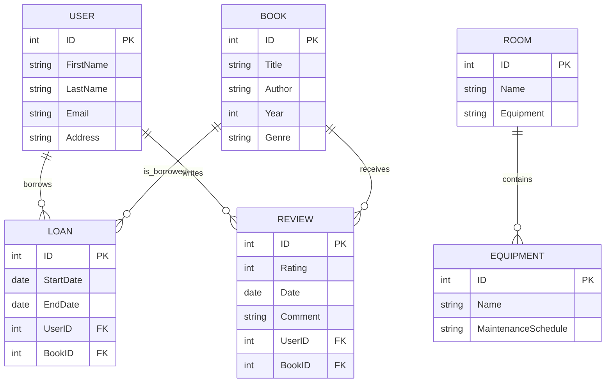

### Esempio di Soluzione

#### Progettazione Concettuale



#### Progettazione Logica

#### Tabelle

- **USER**: id `PK`, first_name, last_name, email, address
- **BOOK**: id `PK`, title, author, year, genre
- **LOAN**: id `PK`, start_date, end_date, user_id `FK` → USER.id, book_id `FK` → BOOK.id
- **REVIEW**: id `PK`, rating, review_date, comment, user_id `FK` → USER.id, book_id `FK` → BOOK.id
- **ROOM**: id `PK`, name, equipment
- **EQUIPMENT**: id `PK`, name, maintenance_schedule

### Creazione delle Tabelle in SQL

```sql
CREATE TABLE USER (
    id INT PRIMARY KEY,
    first_name VARCHAR(255),
    last_name VARCHAR(255),
    email VARCHAR(255),
    address TEXT
);

CREATE TABLE BOOK (
    id INT PRIMARY KEY,
    title VARCHAR(255),
    author VARCHAR(255),
    year INT,
    genre VARCHAR(255)
);

CREATE TABLE LOAN (
    id INT PRIMARY KEY,
    start_date DATE,
    end_date DATE,
    user_id INT,
    book_id INT,
    FOREIGN KEY (user_id) REFERENCES USER(id),
    FOREIGN KEY (book_id) REFERENCES BOOK(id)
);

CREATE TABLE REVIEW (
    id INT PRIMARY KEY,
    rating INT,
    review_date DATE,
    comment TEXT,
    user_id INT,
    book_id INT,
    FOREIGN KEY (user_id) REFERENCES USER(id),
    FOREIGN KEY (book_id) REFERENCES BOOK(id)
);

CREATE TABLE ROOM (
    id INT PRIMARY KEY,
    name VARCHAR(255),
    equipment TEXT
);

CREATE TABLE EQUIPMENT (
    id INT PRIMARY KEY,
    name VARCHAR(255),
    maintenance_schedule TEXT
);
```

### Inserimento dei Dati in SQL

```sql
INSERT INTO USER (id, first_name, last_name, email, address) VALUES
(1, 'Alice', 'Johnson', 'alice.johnson@example.com', '123 Main St'),
(2, 'Bob', 'Brown', 'bob.brown@example.com', '456 Elm St');

INSERT INTO BOOK (id, title, author, year, genre) VALUES
(1, 'The Great Gatsby', 'F. Scott Fitzgerald', 1925, 'Fiction'),
(2, 'To Kill a Mockingbird', 'Harper Lee', 1960, 'Fiction');

INSERT INTO LOAN (id, start_date, end_date, user_id, book_id) VALUES
(1, '2023-01-01', '2023-01-15', 1, 1),
(2, '2023-01-02', '2023-01-16', 2, 2);

INSERT INTO REVIEW (id, rating, review_date, comment, user_id, book_id) VALUES
(1, 5, '2023-01-10', 'Amazing book!', 1, 1),
(2, 4, '2023-01-11', 'Very good read.', 2, 2);

INSERT INTO ROOM (id, name, equipment) VALUES
(1, 'Reading Room 1', 'Desks, Chairs, Lamps'),
(2, 'Study Room 2', 'Desks, Whiteboard, Projector');

INSERT INTO EQUIPMENT (id, name, maintenance_schedule) VALUES
(1, 'Desks', 'Monthly'),
(2, 'Chairs', 'Quarterly'),
(3, 'Lamps', 'Bi-Annually'),
(4, 'Whiteboard', 'Annually'),
(5, 'Projector', 'Annually');
```