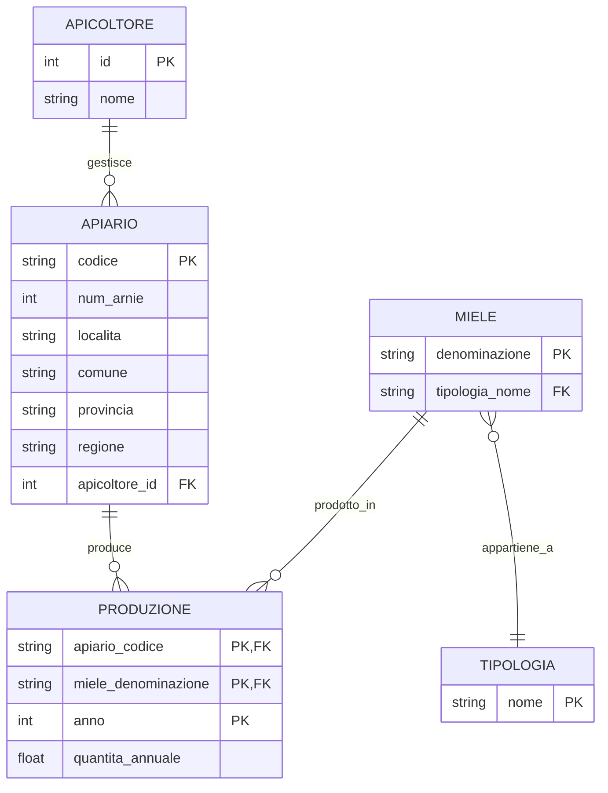

```mermaid
erDiagram
    APICOLTORE ||--o{ APIARIO : gestisce
    APIARIO ||--o{ PRODUZIONE : produce
    MIELE ||--o{ PRODUZIONE : prodotto_in
    MIELE }o--|| TIPOLOGIA : appartiene_a

    APICOLTORE {
        int id PK
        string nome
    }

    APIARIO {
        string codice PK
        int num_arnie
        string localita
        string comune
        string provincia
        string regione
        int apicoltore_id FK
    }

    PRODUZIONE {
        string apiario_codice PK, FK
        string miele_denominazione PK, FK
        int anno PK
        float quantita_annuale
    }

    MIELE {
        string denominazione PK
        string tipologia_nome FK
    }

    TIPOLOGIA {
        string nome PK
    }
```
