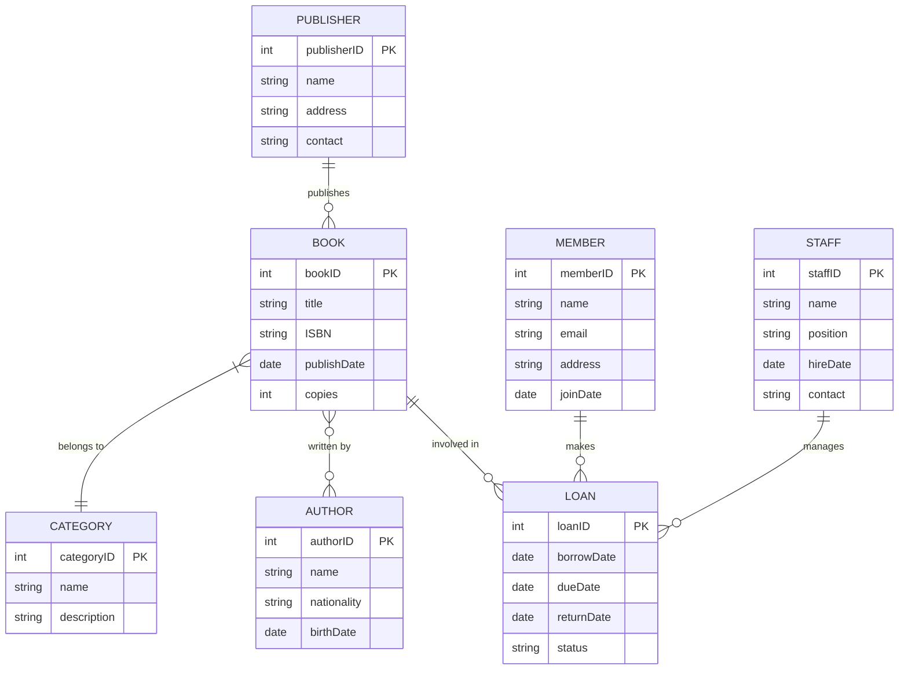
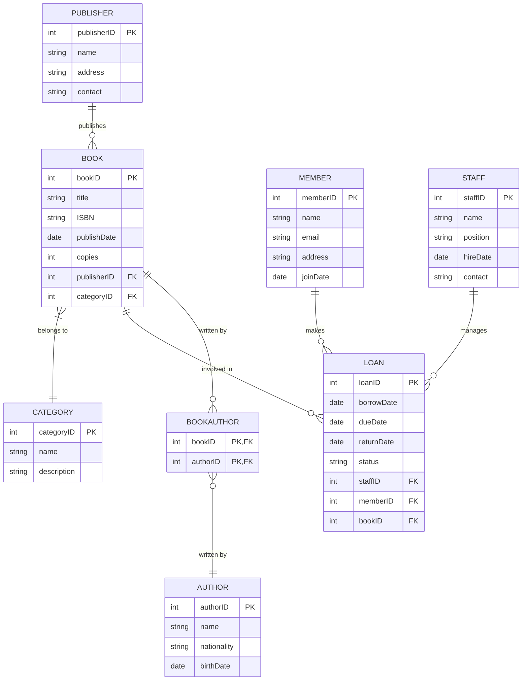

## Soluzione

### Schema concettuale

#### Versione 1



#### Versione 2



### Progettazione Logica del Diagramma ER

1. 1NF rispettata: address e contact si potrebbero scomporre
2. 2NF rispettata
3. 3NF: rimuovo bookID e lascio ISBN come PK


### Create Query
```sql
-- Create database
CREATE DATABASE library;
USE library;

-- Create tables
CREATE TABLE CATEGORY (
    categoryID INT PRIMARY KEY AUTO_INCREMENT,
    name VARCHAR(100) NOT NULL,
    description TEXT
);

CREATE TABLE PUBLISHER (
    publisherID INT PRIMARY KEY AUTO_INCREMENT,
    name VARCHAR(100) NOT NULL,
    address TEXT,
    contact VARCHAR(100)
);

CREATE TABLE AUTHOR (
    authorID INT PRIMARY KEY AUTO_INCREMENT,
    name VARCHAR(100) NOT NULL,
    nationality VARCHAR(50),
    birthDate DATE
);

CREATE TABLE BOOK (
    ISBN VARCHAR(13) PRIMARY KEY,
    title VARCHAR(200) NOT NULL,
    publishDate DATE,
    copies INT DEFAULT 1,
    publisherID INT,
    categoryID INT,
    FOREIGN KEY (publisherID) REFERENCES PUBLISHER(publisherID),
    FOREIGN KEY (categoryID) REFERENCES CATEGORY(categoryID)
);

CREATE TABLE BOOKAUTHOR (
    bookID INT,
    authorID INT,
    PRIMARY KEY (bookID, authorID),
    FOREIGN KEY (bookID) REFERENCES BOOK(bookID),
    FOREIGN KEY (authorID) REFERENCES AUTHOR(authorID)
);

CREATE TABLE MEMBER (
    memberID INT PRIMARY KEY AUTO_INCREMENT,
    name VARCHAR(100) NOT NULL,
    email VARCHAR(100) UNIQUE,
    address TEXT,
    joinDate DATE
);

CREATE TABLE STAFF (
    staffID INT PRIMARY KEY AUTO_INCREMENT,
    name VARCHAR(100) NOT NULL,
    position VARCHAR(50),
    hireDate DATE,
    contact VARCHAR(100)
);

CREATE TABLE LOAN (
    loanID INT PRIMARY KEY AUTO_INCREMENT,
    borrowDate DATE NOT NULL,
    dueDate DATE NOT NULL,
    returnDate DATE,
    status VARCHAR(20),
    staffID INT,
    memberID INT,
    bookID INT,
    FOREIGN KEY (staffID) REFERENCES STAFF(staffID),
    FOREIGN KEY (memberID) REFERENCES MEMBER(memberID),
    FOREIGN KEY (bookID) REFERENCES BOOK(bookID)
);

-- Insert sample data
INSERT INTO CATEGORY (name, description) VALUES
('Fiction', 'Fictional literature'),
('Non-Fiction', 'Based on facts'),
('Science', 'Scientific literature');

INSERT INTO PUBLISHER (name, address, contact) VALUES
('Penguin Books', '123 Publishing St', '+1-555-0123'),
('Random House', '456 Book Ave', '+1-555-0456');

INSERT INTO AUTHOR (name, nationality, birthDate) VALUES
('J.K. Rowling', 'British', '1965-07-31'),
('George Orwell', 'British', '1903-06-25');

INSERT INTO BOOK (ISBN, title, publishDate, copies, publisherID, categoryID) VALUES
('9780747532699', 'Harry Potter', '1997-06-26', 5, 1, 1),
('9780451524935', '1984', '1949-06-08', 3, 2, 1);

INSERT INTO BOOKAUTHOR (bookID, authorID) VALUES
('9780747532699', 1),
('9780747532699', 2),
('9780451524935', 2);

INSERT INTO MEMBER (name, email, address, joinDate) VALUES
('John Doe', 'john@email.com', '789 Reader St', '2023-01-01'),
('Jane Smith', 'jane@email.com', '321 Book Ln', '2023-02-01');

INSERT INTO STAFF (name, position, hireDate, contact) VALUES
('Alice Johnson', 'Librarian', '2022-01-01', '+1-555-0789'),
('Bob Wilson', 'Assistant', '2022-06-01', '+1-555-0321');

INSERT INTO LOAN (borrowDate, dueDate, returnDate, status, staffID, memberID, bookID) VALUES
('2023-03-01', '2023-03-15', '2023-03-14', 'Returned', 1, 1, 1),
('2023-03-10', '2023-03-24', NULL, 'Borrowed', 2, 2, 2);
```