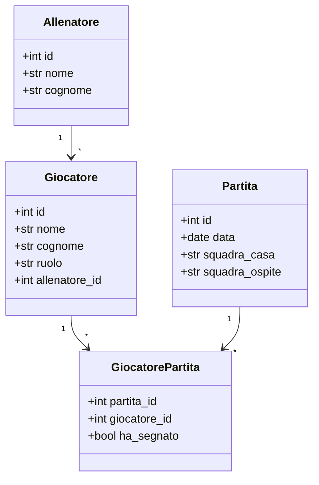

# UML Class Diagram - Calcio

```mermaid
classDiagram
    class Allenatore {
        +int id
        +str nome
        +str cognome
    }
    class Giocatore {
        +int id
        +str nome
        +str cognome
        +str ruolo
        +int allenatore_id
    }
    class Partita {
        +int id
        +date data
        +str squadra_casa
        +str squadra_ospite
    }
    class GiocatorePartita {
        +int partita_id
        +int giocatore_id
        +bool ha_segnato
    }

    Allenatore "1" --> "*" Giocatore
    Giocatore "1" --> "*" GiocatorePartita
    Partita "1" --> "*" GiocatorePartita
```
