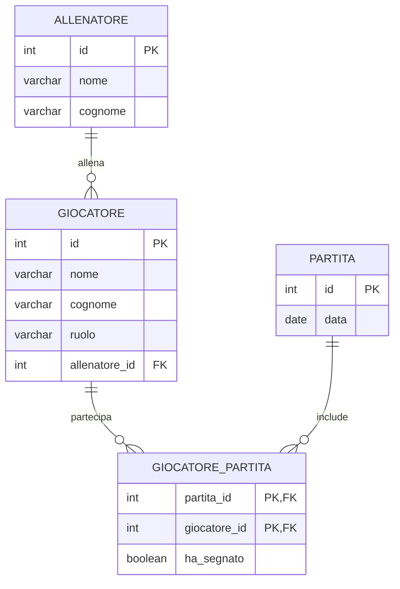

# Database Schema - Calcio

The diagram shows the relationships between the tables:
- One ALLENATORE can coach zero or many GIOCATORE (1:N)
- One GIOCATORE can participate in zero or many PARTITA through GIOCATORE_PARTITA (N:M)
- One PARTITA involves multiple GIOCATORE through GIOCATORE_PARTITA
