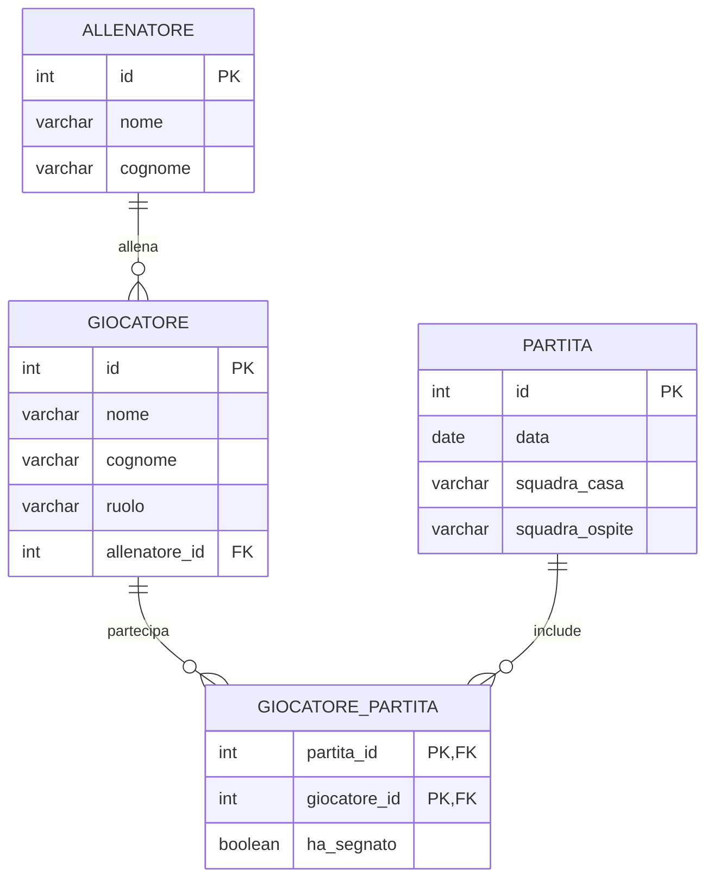

# Database Schema - Calcio

```mermaid
erDiagram
    ALLENATORE {
        int id PK
        varchar nome
        varchar cognome
    }
    GIOCATORE {
        int id PK
        varchar nome
        varchar cognome
        varchar ruolo
        int allenatore_id FK
    }
    PARTITA {
        int id PK
        date data
        varchar squadra_casa
        varchar squadra_ospite

    }
    GIOCATORE_PARTITA {
        int partita_id PK,FK
        int giocatore_id PK,FK
        boolean ha_segnato
    }

    ALLENATORE ||--o{ GIOCATORE : allena
    GIOCATORE ||--o{ GIOCATORE_PARTITA : partecipa
    PARTITA ||--o{ GIOCATORE_PARTITA : include
```
